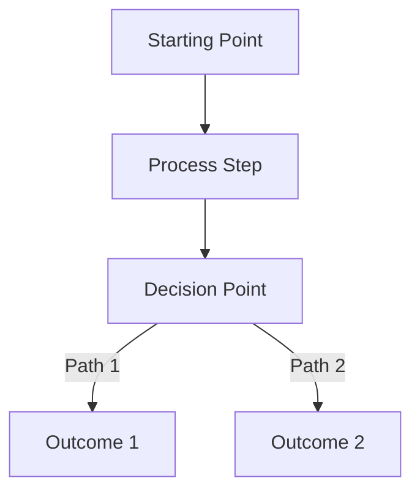
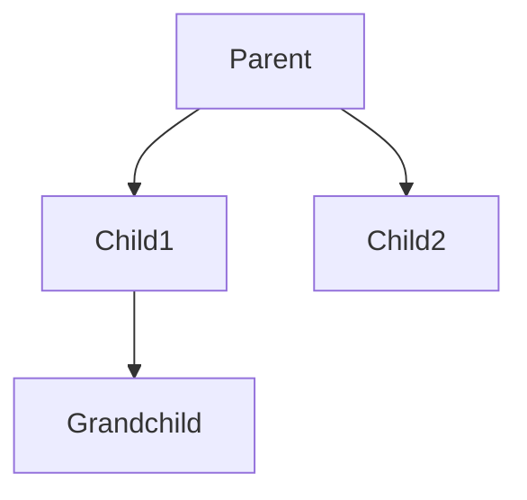

# Student-Centered Instructional Framework

## Core Principle: Optimize for Learning, Not Brevity

**Every element serves student understanding, confidence, and success.**

---

## Standard Task Structure

### 🎯 [Task Name] — [Expected Outcome]

**What you'll accomplish:** Clear, motivating outcome statement

**Prerequisites:**
- ☑️ Prerequisite 1
- ☑️ Prerequisite 2

**💡 Quick Path:** For experienced students
- Step 1 → Step 3 → Step 5 (skip explanatory steps)
- Key commands: `npm run dev`, `git commit`

---

### **Steps:**

#### 1. [Action verb + specific target]

**File:** `path/to/file.js`

```javascript
// Code with inline comments explaining key concepts
const example = "code here";
```

**Line-by-line breakdown:**
- **Line 1:** What this line does and why
- **Line 2:** What this line does and why

**Expected result:** What you should see/experience

**If something goes wrong:**
- ⚠️ **Problem:** Specific error message
  - **Solution:** How to fix it
  - **Command:** `specific command if needed`

#### 2. [Next action verb + target]

[Continue pattern...]

---

**✅ Success Checkpoint:**
- ☑️ Verification item 1
- ☑️ Verification item 2
- ☑️ Verification item 3

**🏆 Bonus Challenge:** Optional extension for advanced learners

**🔬 Deep Dive:** Technical explanation for curious students
[Detailed explanation of underlying concepts]

**🤔 Pause & Reflect:**
- Question prompting metacognition
- Question connecting to prior knowledge
- Question encouraging prediction

**💼 Professional Context:**
- **In the industry:** How professionals use this
- **Career connection:** Why this matters for jobs
- **Portfolio tip:** How to showcase this skill

---

## Code Block Standards

### Single File Update
```javascript
**File:** `src/components/Example.jsx`

// Clear comments explaining purpose
export default function Example({ prop1, prop2 }) {
  // Implementation with explanatory comments
  return <div>Content</div>;
}
```

### Multi-Step Code Changes
```javascript
**Step 1:** Add imports at the top
import { useState } from 'react';

**Step 2:** Add state (place before return statement)
const [count, setCount] = useState(0);

**Step 3:** Add event handler
const handleClick = () => setCount(prev => prev + 1);
```

### Complex Component with Sections
```javascript
function ComplexComponent() {
  // 📦 STATE MANAGEMENT
  const [data, setData] = useState(null);
  
  // 🎯 EVENT HANDLERS
  const handleSubmit = () => {
    // Handler logic
  };
  
  // 🎨 HELPER FUNCTIONS
  const formatData = (input) => {
    // Helper logic
  };
  
  // 🖼️ RENDER
  return (
    <div>
      {/* JSX with explanatory comments */}
    </div>
  );
}
```

---

## Error Prevention & Troubleshooting

### ⚠️ Common Issues & Solutions

**Problem:** Specific error message or behavior
- **Why this happens:** Root cause explanation
- **Solution:** Step-by-step fix
- **Prevention:** How to avoid in future
- **Command:** `specific debugging command`

**Problem:** Another common issue
- **Quick fix:** Immediate solution
- **Debug:** How to investigate
- **Learn more:** Link to documentation

---

## Visual Learning Integration

### Before you start: Mental model



**What this diagram shows:** Explanation of the flow and why it matters

### Component Relationships



**Understanding the hierarchy:** How components communicate and share data

---

## Scaffolded Independence Levels

### Level 1: Detailed Guidance (Sessions 1-2)
- Every step explained
- Expected results provided
- Common errors anticipated
- Success checkpoints frequent

### Level 2: Guided Practice (Sessions 3-5)
- Steps with hints
- "Try implementing..." prompts
- Verification questions
- Reference to previous patterns

### Level 3: Supported Independence (Sessions 6-8)
- Challenge-based tasks
- Requirements checklist
- Reference files provided
- Testing strategies given

### Level 4: Full Independence (Sessions 9+)
- Problem statement only
- Self-directed implementation
- Peer review opportunities
- Professional-level expectations

---

## Assessment Integration

### 🎯 Quick Check
Before moving on, can you:
- ☑️ Explain [concept] in your own words
- ☑️ Predict what happens if you change [variable]
- ☑️ Identify the [pattern] in the code

### 🔍 Self-Assessment
Rate your confidence (1-5):
- Understanding the concept: ___
- Implementing independently: ___
- Explaining to others: ___

**If you rated 3 or below:** Review [specific section] or ask for help

---

## Callout Box Standards

### 💡 Concept
**Core learning point that connects to bigger picture**

Use when: Introducing new fundamental concept

### ⚠️ Warning
**Common mistake or critical information**

Use when: Students frequently make this error

### 🏆 Challenge
**Extension activity for advanced learners**

Use when: Providing optional depth

### ✅ Checkpoint
**Verification step to confirm understanding**

Use when: Natural pause point in workflow

### 🔬 Deep Dive
**Advanced explanation for curious students**

Use when: Concept has interesting technical depth

### 🤔 Reflection
**Metacognitive prompt**

Use when: Encouraging thinking about thinking

### 💼 Professional Context
**Real-world application**

Use when: Connecting to industry practices

### 🎯 Learning Objective
**What students will master**

Use when: Starting new major section

---

## Markdown Hierarchy Standards

```markdown
# Session Title (H1)
## Major Concept Section (H2)
### Specific Task (H3)
#### Sub-step if needed (H4)

**Bold** for action verbs and key terms
*Italic* for emphasis (use sparingly)
`Code` for inline code, commands, file names
```

---

## Complete Example: Session 5 Transformation Task

### 🎯 Transform API Data — Convert Raw JSON to Game Format

**What you'll accomplish:** Build an incremental transformation pipeline that converts URL-encoded API responses into clean, game-ready question objects with shuffled answers

**Prerequisites:**
- ☑️ Fetch foundation is working (Phase 1 complete)
- ☑️ Console shows raw API data
- ☑️ Helper functions (decodeText, shuffleAnswers) exist in file

**💡 Quick Path:** For experienced students
- Phase 1 → Phase 3 → Phase 4 (skip intermediate logging)
- Key pattern: Extract → Transform → Return

---

### **Steps:**

#### Phase 1: Extract Properties

**File:** `src/services/trivia.js` (find transformQuestion function)

```javascript
function transformQuestion(apiQuestion) {
  // Extract the three key pieces from API response
  const question = apiQuestion.question;
  const incorrectAnswers = apiQuestion.incorrect_answers;
  const correctAnswer = apiQuestion.correct_answer;
  
  // Log to verify extraction worked
  console.log("Extracted:", { question, incorrectAnswers, correctAnswer });
}
```

**Line-by-line breakdown:**
- **Lines 2-4:** Destructure API object into named variables for clarity
- **Line 7:** Temporary logging to verify data extraction (we'll remove this later)

**Expected result:** Console shows object with three properties, still URL-encoded

**If something goes wrong:**
- ⚠️ **Problem:** `undefined` appears in console
  - **Solution:** Check API response structure - verify property names match
  - **Debug:** Add `console.log(apiQuestion)` to see full object

---

#### Phase 2: Decode Text

**File:** `src/services/trivia.js` (update transformQuestion function)

```javascript
function transformQuestion(apiQuestion) {
  // Use helper function to decode URL encoding
  const question = decodeText(apiQuestion.question);
  const incorrectAnswers = apiQuestion.incorrect_answers.map(answer => decodeText(answer));
  const correctAnswer = decodeText(apiQuestion.correct_answer);
  
  console.log("Decoded:", { question, incorrectAnswers, correctAnswer });
}
```

**Line-by-line breakdown:**
- **Line 3:** Single question decoded: `"What%20is%20GHz"` → `"What is GHz"`
- **Line 4:** Array.map() applies decodeText to each incorrect answer
- **Line 5:** Correct answer decoded the same way

**Expected result:** Console shows readable text: `"What does GHz stand for?"`

**If something goes wrong:**
- ⚠️ **Problem:** Text still shows `%20` symbols
  - **Solution:** Verify decodeText function exists and is imported
  - **Check:** Look for `function decodeText` earlier in file

**🔬 Deep Dive: Why map()?**

The `map()` method is perfect for transforming arrays. It takes each item, applies a function, and returns a new array with the results. This is a fundamental pattern in functional programming that you'll use constantly in React development.

```javascript
// What map() does internally:
const incorrectAnswers = ["Answer%201", "Answer%202"];
const decoded = incorrectAnswers.map(answer => decodeText(answer));
// Result: ["Answer 1", "Answer 2"]
```

---

#### Phase 3: Shuffle and Find Index

**File:** `src/services/trivia.js` (update transformQuestion function)

```javascript
function transformQuestion(apiQuestion) {
  const question = decodeText(apiQuestion.question);
  const incorrectAnswers = apiQuestion.incorrect_answers.map(answer => decodeText(answer));
  const correctAnswer = decodeText(apiQuestion.correct_answer);
  
  // Combine and randomize all answers
  const shuffledAnswers = shuffleAnswers(correctAnswer, incorrectAnswers);
  
  // Find where correct answer ended up after shuffle
  const correctIndex = shuffledAnswers.indexOf(correctAnswer);
  
  console.log("Shuffled answers:", shuffledAnswers);
  console.log("Correct answer is at index:", correctIndex);
}
```

**Line-by-line breakdown:**
- **Line 7:** Helper function combines correct + incorrect, then randomizes order
- **Line 10:** Find array position (0-3) where correct answer landed
- **Lines 12-13:** Verify shuffle worked and we tracked correct position

**Expected result:** Console shows 4 answers in random order, index points to correct one

**Why shuffle matters:** Without randomization, correct answer would always be in the same position, making the game too easy and predictable.

---

#### Phase 4: Return Game Object

**File:** `src/services/trivia.js` (complete transformQuestion function)

```javascript
function transformQuestion(apiQuestion) {
  const question = decodeText(apiQuestion.question);
  const incorrectAnswers = apiQuestion.incorrect_answers.map(answer => decodeText(answer));
  const correctAnswer = decodeText(apiQuestion.correct_answer);
  const shuffledAnswers = shuffleAnswers(correctAnswer, incorrectAnswers);
  const correctIndex = shuffledAnswers.indexOf(correctAnswer);
  
  // Return object in exact format our game components expect
  return {
    question: question,
    answers: shuffledAnswers,
    correct: correctIndex
  };
}
```

**Expected result:** Function returns complete game object ready for quiz component

**Object structure explained:**
```javascript
{
  question: "What does CPU stand for?",      // Decoded question text
  answers: [                                  // All 4 answers shuffled
    "Central Process Unit",
    "Computer Personal Unit", 
    "Central Processing Unit",               // Correct answer (position varies)
    "Central Processor Unit"
  ],
  correct: 2                                  // Index of correct answer (0-3)
}
```

---

#### Phase 5: Integrate with Fetch

**File:** `src/services/trivia.js` (in fetchQuestions function, after validation)

```javascript
// Transform entire results array using map
const questions = data.results.map(apiQuestion => transformQuestion(apiQuestion));
console.log("All transformed questions:", questions);
return questions;
```

**Expected result:** Array of 3-5 game-ready question objects

**🔬 Deep Dive: Array.map() for Transformation**

This is a core pattern in web development: take an array of data in one format, transform each item, get back an array in a new format. You're seeing the same pattern twice:
1. Transform array of encoded answers → decoded answers
2. Transform array of API questions → game questions

This composability is what makes functional programming powerful.

---

**✅ Success Checkpoint:**
- ☑️ Console shows decoded question text (no `%20` symbols)
- ☑️ Answers array contains 4 items in random order
- ☑️ Correct index points to right answer (verify by checking text)
- ☑️ No console errors about undefined properties
- ☑️ React DevTools shows `currentQuestions` populated with transformed data

**🏆 Bonus Challenge:** 
Add error handling for malformed API responses. What should happen if `incorrect_answers` is missing or empty? Implement a fallback that returns a valid question object even with incomplete data.

**🤔 Pause & Reflect:**
- What pattern do you notice in how we built this transformation incrementally?
- Why did we test after each phase instead of writing everything at once?
- How would you explain the difference between the API format and game format to a peer?

**💼 Professional Context:**
- **In the industry:** Data transformation pipelines like this power every app that uses external APIs - Netflix transforms movie data, Spotify transforms song data, Instagram transforms image data
- **Career connection:** "API integration with data transformation" is a key skill in React developer job descriptions
- **Portfolio tip:** Mention "Built robust data transformation pipeline with error handling" in your project description

---

This framework prioritizes student success through:
- Clear learning objectives
- Scaffolded complexity
- Multiple verification points
- Error prevention and troubleshooting
- Metacognitive prompts
- Professional context
- Multiple learning pathways
