<!-- filepath: /home/bobleeswagger/wizcamp-realms-demo/session-guides/SESSION-01-architecture.md -->
# 🏗️ Session 01 — Dev Environment Architecture

A visual diagram showing relationships between GitHub Codespaces, OS, runtimes, dev tools, and the browser preview.

## Mermaid diagram (preferred)

```mermaid
flowchart TB
  %% Actors
  Dev["Developer\n(Browser or VS Code Desktop)"]
  Browser(("Browser Preview"))

  %% Codespace container (contains OS + DevTools + editor config)
  subgraph Codespace["GitHub Codespace 🧭"]
    direction TB
    DevContainer[".devcontainer\n(config)"]
    subgraph OS["Ubuntu (container OS) 🐧"]
      direction TB
      Node["Node.js\n(runtime) ⚙️"]
      NPM["npm / package manager 📦"]
    end
    subgraph DevTools["Dev tools & App"]
      direction TB
      Vite["Vite\n(dev server) ⚡"]
      HMR["HMR\n(Hot Module Replacement) 🔁"]
      React["React App\n(src/*.jsx / components) ⚛️"]
      Files["Project files\n(src/, public/) 🗂️"]
    end
    VSCode["VS Code\n(remote editor) 🖥️"]
  end

  %% Relationships
  Dev -->|opens remote session| VSCode
  VSCode -->|remote connection| Codespace
  Dev -->|open preview| Browser

  DevContainer --> OS
  OS --> Node
  Node --> NPM
  NPM --> Vite
  NPM --> React
  Files --> React
  React -->|built / served by| Vite
  Vite --> HMR
  HMR --> Browser
  Vite -->|serves on localhost| Browser

  %% Classes (styling)
  class Dev,Browser actorClass
  class Node,NPM osClass
  class Vite,HMR,React devtoolsClass
  class VSCode codespaceToolClass
  class DevContainer,Files diagNotes

  %% Visual style definitions
  classDef actorClass fill:#ffffff,stroke:#94a3b8,stroke-width:1px,color:#0f172a;
  classDef osClass fill:#ecfdf5,stroke:#34d399,stroke-width:1px,color:#065f46;
  classDef devtoolsClass fill:#fff7ed,stroke:#fb923c,stroke-width:1px,color:#92400e;
  classDef codespaceToolClass fill:#eef2ff,stroke:#7c3aed,stroke-width:1px,color:#3730a3;
  classDef diagNotes fill:#f8fafc,stroke:#e2e8f0,stroke-width:1px,color:#0f172a;

  %% Optional styling for clarity (some renderers support 'style' for nodes)
  style Codespace fill:#f0f9ff,stroke:#60a5fa,stroke-width:2px
```


### Legend / Notes
- Codespace = remote container running Ubuntu with your project's config (.devcontainer).
- Node + npm = runtime + package manager used to install/run Vite and the React app.
- Vite = dev server with HMR; serves the app on localhost to the Browser preview.
- VS Code (remote) = editor connected to the Codespace for live editing.

## ASCII fallback (for plaintext renderers)

```
Developer (Browser / VS Code)
        |
  -------------------
  |                 |
VS Code (remote)  Browser (preview)
  |                 ^
  |                 |
  |   ┌───────── GitHub Codespace ─────────┐
  |   |  .devcontainer  (config)           |
  |   |      |                              |
  |   |   Ubuntu (container OS)             |
  |   |      |                              |
  |   |   Node.js (runtime)                 |
  |   |      |                              |
  |   |    npm (package manager)            |
  |   |     /      \                        |
  |   |    /        \                       |
  |   | Vite (dev server)  React (source)   |
  |   |    |   \        /   ^               |
  |   |    |    \      /    |               |
  |   |    |     HMR updates/patches        |
  |   |    |            |                   |
  |   |    |            v                   |
  |   |    |        Browser <--- serves on localhost
  |   └─────────────────────────────────────┘
```