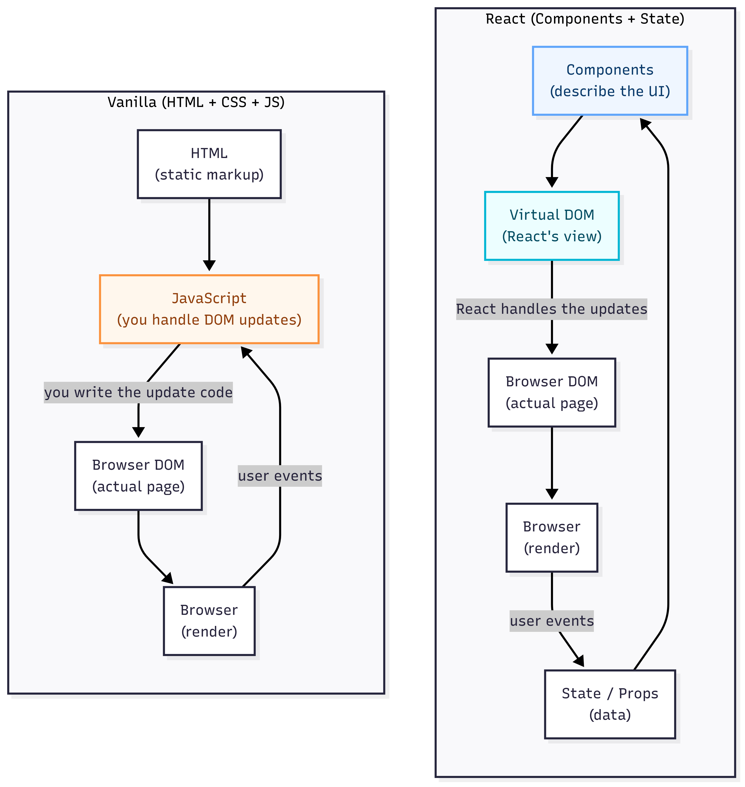

# Session 2 — Building Game Components

You're about to build your first custom React component and unlock the power of reusable UI building blocks — the secret to fast, scalable development in React. This guide walks you through creating a GameButton component, understanding props, and using React developer tools. Ready to build your first component? Let's go!

## Table of Contents

- [Understanding React's Approach](#understanding-reacts-approach)
- [Creating Your First Component](#creating-your-first-component)
- [Understanding Props](#understanding-props)
- [Adding Click Functionality](#adding-click-functionality)
- [Styling with Variants](#styling-with-variants)
- [Reusing Your Component](#reusing-your-component)
- [Installing React DevTools](#installing-react-devtools)
- [Essential Terms](#essential-terms)
- [Ask the AI](#ask-the-ai)

<a id="accessing-your-codespace"></a>

## ☁️ Accessing Your Codespace

Visit [github.com/codespaces](https://github.com/codespaces) to relaunch your Codespace from Session 1.

<a id="understanding-reacts-approach"></a>

## 💡 Understanding React's Approach

Why did swapping `<StartHere />` for `<SplashScreen />` feel so effortless? It's all about React's approach to building UIs.

With vanilla JavaScript, you write lots of repetitive code to update the page. React works differently: you build self-contained components, and React handles all the messy details of getting them on screen and keeping them updated.


*Figure: Vanilla JavaScript vs React — Why Components Make Development Easier*

That's why swapping components felt so smooth. You weren't just editing code—you were shaping the UI with reusable building blocks.

Now let's build your first custom component and see that power in action.

<a id="creating-your-first-component"></a>

## 🧩 Creating Your First Component

🎯 **Goal:** Build a reusable GameButton component and learn how to export, import, and use custom components.

### Step 1: Create the component file

**Right-click** `src/components` → New File → name it `GameButton.jsx`

### Step 2: Write the component structure

Create the basic component function that returns a button element.

**File:** `src/components/GameButton.jsx`

```javascript
export default function GameButton() {
  return <button>Start Adventure</button>;
}
```

### Step 3: Import and use the component

Import your new GameButton component into SplashScreen and add it to the JSX to see it render on the page.

**File:** `src/components/SplashScreen.jsx`

```diff
 import GameLogo from "./GameLogo";
+import GameButton from "./GameButton";

export default function SplashScreen() {
  return (
    <div className="splash-screen">
      <GameLogo />
-     <div className="splash-buttons"></div>
+     <div className="splash-buttons">
+       <GameButton />
+     </div>
    </div>
  );
}
```

### Step 4: Test your component

**Run** `npm run dev` if not already running.

**✓ You should see:** Your custom button appears on the splash screen!

> 💡 **Export and Import Pattern**
>
> Components are the heart of React — reusable UI elements that combine markup, styling, and logic. Think of them as your own custom HTML tags. The `.jsx` file extension means you're writing JSX, a special syntax that looks like HTML but is actually JavaScript. When you create a component, export it with `export default` so it can be shared across your project. Then bring it into other files with `import`.

> 🏆 **Bonus Challenge**
>
> Try changing the button text in GameButton.jsx and watch it update instantly thanks to Hot Module Replacement!

<a id="understanding-props"></a>

## 📦 Understanding Props

🎯 **Goal:** Make your GameButton flexible by accepting custom text through props.

### Step 1: Add text prop to GameButton

Update the component to accept a `text` prop, replacing the hardcoded button text with a dynamic value.

**File:** `src/components/GameButton.jsx`

```javascript
// Add text parameter in curly braces
export default function GameButton({ text }) {
  // Replace hardcoded text with {text}
  return <button>{text}</button>;
}
```

### Step 2: Pass the text prop from SplashScreen

Pass the button text from the parent component as a prop.

**File:** `src/components/SplashScreen.jsx`

```javascript
export default function SplashScreen() {
  return (
    <div className="splash-screen">
      <GameLogo />
      <div className="splash-buttons">
        <GameButton text="Start Adventure" />
        {/* ↑ Add text prop with value */}
      </div>
    </div>
  );
}
```

**✓ You should see:** Your button now shows custom text!

> 💡 **Parent-to-Child Data Flow**
>
> **Props** let parent components pass data to child components — just like function parameters. This makes your components flexible and reusable. The `{ text }` syntax is called **destructuring** — it pulls out just the values you need from the **props** object, keeping your code clean and readable.

<a id="adding-click-functionality"></a>

## 🖱️ Adding Click Functionality

🎯 **Goal:** Make your button interactive by adding click handlers through props.

### Step 1: Add onClick prop to GameButton

Update the component to accept an `onClick` prop and attach it to the button element.

**File:** `src/components/GameButton.jsx`

```javascript
// Add onClick parameter
export default function GameButton({ text, onClick }) {
  // Add onClick to button element
  return <button onClick={onClick}>{text}</button>;
}
```

### Step 2: Pass click handler from SplashScreen

Pass a function that will execute when the button is clicked.

**File:** `src/components/SplashScreen.jsx`

```javascript
<div className="splash-buttons">
  <GameButton
    text="Start Adventure"
    onClick={() => alert('Start Game!')}
  />
  {/* ↑ Add onClick prop */}
</div>
```

### Step 3: Test the GameButton

**Click** "Start Adventure" on your splash screen.

**✓ You should see:** A browser alert with the message "Start Game!" appears!

> 💡 **Giving Components Different Behaviors**
>
> Functions as props are like giving your components different personalities. Your GameButton can do different things depending on where you use it — same button, different actions. It's a key pattern in React for building interactive apps.

<a id="styling-with-variants"></a>

## 🎨 Styling with Variants

🎯 **Goal:** Add visual variety to your buttons using CSS classes and default parameters.

### Step 1: Add variant prop and dynamic className

Add a `variant` prop with a default value to control button styling, then create a dynamic className that combines the base class with the variant.

**File:** `src/components/GameButton.jsx`

```javascript
// Add variant parameter with default value
export default function GameButton({ text, onClick, variant = "primary" }) {
  // Add this line: create buttonClass variable
  const buttonClass = `game-button ${variant}`;

  return (
    <button className={buttonClass} onClick={onClick}>
      {/* ↑ Update to use className */}
      {text}
    </button>
  );
}
```

### Step 2: Use the variant prop in SplashScreen

Pass the `variant` prop to specify which button style to use.

**File:** `src/components/SplashScreen.jsx`

```javascript
<div className="splash-buttons">
  <GameButton
    text="Start Adventure"
    onClick={() => alert('Start Game!')}
    variant="primary"
  />
  {/* ↑ Add variant prop */}
</div>
```

**✓ You should see:** Your button now has the primary styling with a vibrant color!

> 💡 **Building Dynamic Class Names**
>
> **className** is React's version of the HTML `class` attribute. We use a **template literal** to build a dynamic class name like `game-button primary`. This matches the styles already defined in your project. The `variant` prop lets you switch between styles like `primary` and `secondary`, and **default parameters** like `variant = "primary"` ensure your component still works even if no variant is passed.

<a id="reusing-your-component"></a>

## 🔄 Reusing Your Component

🎯 **Goal:** Experience the power of component reusability by adding a second button with different props.

**File:** `src/components/SplashScreen.jsx`

Add a second GameButton with different prop values to demonstrate how the same component can be reused with different configurations.

```javascript
<div className="splash-buttons">
  <GameButton
    text="Start Adventure"
    onClick={() => alert('Start Game!')}
    variant="primary"
  />
  {/* ↑ Existing button */}
  
  <GameButton
    text="Credits"
    onClick={() => alert('Show Credits')}
    variant="secondary"
  />
  {/* ↑ Add this button */}
</div>
```

**✓ You should see:** Two different buttons using the same component!

> 💡 **Write Once, Use Everywhere**
>
> Component reusability is React's superpower. You wrote the GameButton code once, but now you can use it anywhere in your app with different props. Thanks to your stylesheet, each variant (`primary`, `secondary`) automatically applies the right look — no extra styling needed.

> 🏆 **Bonus Challenge**
>
> Try adding a third GameButton with `variant="primary"` and `text="Instructions"` to see how easy it is to scale your UI!

<a id="installing-react-devtools"></a>

## 🔍 Installing React DevTools

🎯 **Goal:** Install and explore React DevTools to inspect your components and props.

### Step 1: Install the browser extension

**Choose** your browser and install React DevTools:

| Browser     | Installation Link                                                                                                        | Notes               |
| ----------- | ------------------------------------------------------------------------------------------------------------------------ | ------------------- |
| **Chrome**  | [Chrome Web Store](https://chrome.google.com/webstore/detail/react-developer-tools/fmkadmapgofadopljbjfkapdkoienihi)     | Most popular choice |
| **Firefox** | [Firefox Add-ons](https://addons.mozilla.org/en-US/firefox/addon/react-devtools/)                                        | Great alternative   |
| **Edge**    | [Edge Add-ons](https://microsoftedge.microsoft.com/addons/detail/react-developer-tools/gpphkfbcpidddadnkolkpfckpihlkkil) | Windows default     |
| **Safari**  | Manual installation required                                                                                             | Advanced users only |

### Step 2: Open and explore DevTools

1. **Press** `F12` or right-click → Inspect
2. **Find** the Components tab (next to Console, Network, etc.)
3. **Click** on components in the tree to see their props
4. **Find** your GameButton component and inspect its props

**✓ You should see:** The text, onClick, and variant props displayed in the DevTools panel!

> 💡 **Real-Time Component Inspection**
>
> **React DevTools** gives you X-ray vision into your app. You can inspect components, props, and state in real time — essential for debugging and understanding how your app works under the hood.

<a id="essential-terms"></a>

## 📋 Essential Terms

_Quick reference for all the React concepts you just learned:_

| Term   | Definition | Why it matters |
|--------|------------|----------------|
| 📦 props | Data passed from parent to child components. | Props let you customize components and pass data around your app — essential for reusable components. |
| 🎨 className | React's version of the HTML `class` attribute for applying CSS styles. | Use `className` instead of `class` because `class` is a reserved word in JavaScript. |
| 📤 destructuring | Extracting values from objects/arrays into variables, like `{ text, onClick }` from props. | Makes your code cleaner by avoiding repetitive `props.text`, `props.onClick` syntax. |
| 🔤 template literal | String interpolation using backticks and `${}` for dynamic strings. | Perfect for creating dynamic CSS classes like `` `game-button ${variant}` ``. |
| ⚙️ default parameters | Fallback values for function parameters, like `variant = "primary"`. | Ensures your components work even when some props aren't provided. |
| 🔍 React DevTools | Browser extension for inspecting React component trees, props, and state. | Essential debugging tool — like X-ray vision for your React app. |

<a id="ask-the-ai"></a>

## 🤖 Ask the AI — Building Game Components

You just created your first reusable React component with props, styling, and click handlers — excellent work!

Now let's deepen your understanding of components, props, and the React development workflow. Here are the most impactful questions to ask your AI assistant about today's session:

- **What makes React components reusable and why is that important?**
- **How do props work in React and why are they read-only?**
- **How do template literals work and why are they perfect for dynamic CSS classes?**
- **What is interpolation in JSX and can you show me examples?**
- **How does JSX let me write HTML-like code inside JavaScript?**
- **Can I pass functions as props? How does that work and why is it powerful?**
- **What can I do with React DevTools that I can't do with regular browser DevTools?**


