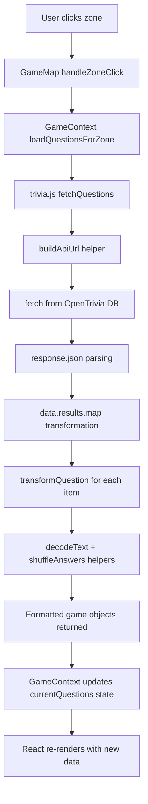

# Session 5 — Generating Dynamic Questions

You're about to connect your trivia game to the real internet! This guide walks you through fetching live trivia questions from external APIs, transforming API data into game-ready format, and experiencing the power of asynchronous programming. Ready to make your zones come alive with real questions? Let's go!

## Table of Contents

- [APIs and External Data](#apis-and-external-data)
- [Exploring the OpenTrivia Database](#exploring-the-opentrivia-database)
- [Asynchronous Programming](#asynchronous-programming)
- [Building the Fetch Foundation](#building-the-fetch-foundation)
- [Transforming API Data](#transforming-api-data)
- [The Complete Data Flow](#the-complete-data-flow)
- [Essential Terms](#essential-terms)
- [Ask the AI](#ask-the-ai)

<a id="accessing-your-codespace"></a>

## ☁️ Accessing Your Codespace

Visit [github.com/codespaces](https://github.com/codespaces) to relaunch your Codespace from Session 4.

<a id="apis-and-external-data"></a>

## 🌐 APIs and External Data

**API** stands for **Application Programming Interface**. An **API** is a set of rules that allows one program to request data or services from another program. When your trivia game needs questions, it sends a request to the OpenTrivia Database **API**, which responds with question data in a structured format.

Think of an **API** as a contract between two programs. The **API** documentation specifies what you can request (questions with specific categories and difficulties), how to format your request (**URL** with parameters), and what format the response will be (**JSON** data). Your code doesn't need to know how OpenTrivia Database stores or generates questions — you just follow the **API** contract to get the data you need.

This separation is fundamental to web development. Your trivia game focuses on user experience while OpenTrivia Database focuses on maintaining a question database. Each program does what it does best, communicating through a well-defined **API**.

> 🏆 **Bonus Challenge**
>
> Think of three apps you use daily — can you identify what external data they might be fetching through APIs?

<a id="exploring-the-opentrivia-database"></a>

## 🔍 Exploring the OpenTrivia Database

Let's explore the **API** that will power your trivia questions and see what real API data looks like.

Visit [https://opentdb.com/api.php?amount=3&category=18&type=multiple&difficulty=easy&encode=url3986](https://opentdb.com/api.php?amount=3&category=18&type=multiple&difficulty=easy&encode=url3986) in your browser to see a live API response.

Here's the **JSON** structure you'll see:

```json
{
  "response_code": 0,                       // ← Status code (0 = success)
  "results": [                              // ← Array of question objects
    {
      "type": "multiple",                   // ← Question type
      "difficulty": "easy",                 // ← Difficulty level
      "category": "Science%3A%20Computers", // ← URL-encoded category
      "question": "What%20is%20RAM%3F",     // ← URL-encoded question
      "correct_answer": "Memory",           // ← The correct answer
      "incorrect_answers": [                // ← Array of wrong answers
        "Processor",
        "Storage", 
        "Graphics"
      ]
    }
  ]
}
```

### Understanding the Response

Notice the `%20` and `%3A` symbols — this is **URL encoding**, a way to safely transmit text over the internet. Each question object has a `question`, `correct_answer`, and `incorrect_answers` array that your game will transform into playable format.

**📚 API Documentation:** For complete details about OpenTrivia Database parameters, response codes, and features, visit: [https://opentdb.com/api_config.php](https://opentdb.com/api_config.php)

> 💡 **JSON: The Language of APIs**
>
> **JSON** (JavaScript Object Notation) is the universal language of **APIs**. It's how different applications share structured data over the internet. Your job as a developer is to transform this raw data into the format your game needs. This pattern — receive, decode, transform, use — appears in every modern web application.

<a id="asynchronous-programming"></a>

## ⏰ Asynchronous Programming

**Synchronous** code executes line by line, waiting for each operation to finish before moving to the next. **Asynchronous** code can start a slow operation (like fetching data from the internet) and continue executing other code while waiting for the result.

Network requests take time — sometimes milliseconds, sometimes seconds. If your game waited synchronously for each **API** request, the entire interface would freeze. Users couldn't click buttons, animations would stop, and the app would appear broken. **Asynchronous programming** solves this by letting your code say "start fetching questions, and notify me when they arrive" then immediately continue responding to user interactions.

JavaScript's **async/await** syntax makes **asynchronous** code readable. The `async` keyword marks a function that performs **asynchronous** operations. The `await` keyword pauses that function until a **promise** resolves, but crucially, it doesn't freeze the entire application — other code continues running. You'll use `async/await` to fetch **API** data without blocking your game.

<a id="building-the-fetch-foundation"></a>

## 🔧 Building the Fetch Foundation

🎯 **Goal:** Implement the core fetch logic to request trivia questions from the OpenTrivia Database API.

**File:** `src/services/trivia.js`

To connect your game to real trivia data, we'll replace the placeholder alert with actual fetch logic that requests data from the API.

> ⚠️ **Hot Module Reloading Behavior**
>
> When you make changes to `trivia.js`, you may see these behaviors:
>
> - Game returns to splash screen (normal)
> - "useGame must be used within a GameProvider" error (also normal)
>
> **To continue:** Refresh the browser (`Ctrl+R` or `Cmd+R`), click "Start Game", then click a zone to test your code.

### Step 1: Add fetch logic

Add fetch logic after the alert to request data from the API.

```javascript
export async function fetchQuestions(zoneId, count = null) {
  // ... existing code ...
  
  try {
    alert(`Loading questions for ${zone.name}`);
    
    // Add fetch logic:
    console.log("Fetching from:", url);        // [1] Log the URL
    const response = await fetch(url);         // [2] Send HTTP request
    const data = await response.json();        // [3] Parse JSON response
    console.log("Raw API data:", data);        // [4] Log the data
  } catch (error) {
    console.log("Failed to fetch questions:", error);
    return [];
  }
}
```

> 💡 **Understanding the Fetch Process**
>
> This code performs four key operations:
>
> 1. **Log the URL**: Shows what endpoint we're calling
> 2. **Send the request**: `await fetch(url)` sends HTTP request and waits for response
> 3. **Parse JSON**: `await response.json()` converts the response text into a JavaScript object
> 4. **Log the data**: Shows the raw API response structure
>
> The `await` keyword pauses execution until each async operation completes, making the code read top-to-bottom like synchronous code. However, the rest of your app remains responsive during these pauses, allowing users to interact with the UI while data is being fetched.


### Step 2: Test the fetch request

Press `F12` or right-click → Inspect to open DevTools. Navigate to the Console tab, then click "Start Game" and click a zone.

**✓ You should see:** Alert appears, then console shows the fetching URL and raw API data. Network tab shows the HTTP request.

<a id="transforming-api-data"></a>

## 🔄 Transforming API Data

🎯 **Goal:** Build a transformation function that converts raw API data into game-ready format through incremental steps.

**File:** `src/services/trivia.js`

**APIs** rarely return data in exactly the format your application needs. The OpenTrivia Database sends URL-encoded text with separate arrays for correct and incorrect answers. Your game needs decoded text with all answers shuffled together and the correct answer's index. This transformation is your responsibility.

### The Transformation Journey

```text
Raw API Data → Your Transform Function → Game-Ready Data
```

**Before (API Response):**
```json
{
  "question": "What%20is%20RAM%3F",
  "correct_answer": "Memory",
  "incorrect_answers": ["Processor", "Storage", "Graphics"]
}
```

**After (Your Game Format):**
```json
{
  "question": "What is RAM?",
  "answers": ["Processor", "Memory", "Storage", "Graphics"],
  "correct": 1
}
```

Let's build the `transformQuestion` function step by step, testing each transformation stage.

### Step 1: Set up transformation testing

Add test code after the fetch logic to verify each transformation step.

```javascript
export async function fetchQuestions(zoneId, count = null) {
  // ... existing code ...
  
  try {
    alert(`Loading questions for ${zone.name}`);

    console.log("Fetching from:", url);
    const response = await fetch(url);
    const data = await response.json();
    console.log("Raw API data:", data);
    
    // Add transformation testing:
    const question = data.results[0];                // [1] Get first question
    console.log("Before transform:", question);      // [2] Log before
    const transformed = transformQuestion(question); // [3] Transform it
    console.log("After transform:", transformed);    // [4] Log after
  } catch (error) {
    console.log("Failed to fetch questions:", error);
    return [];
  }
}
```

> 💡 **Understanding the Testing Process**
>
> This code performs four key operations:
>
> 1. **Get first question**: Extract one question from the API results array for testing
> 2. **Log before**: Show the raw API question format (with URL encoding)
> 3. **Transform it**: Call our transformation function to convert the data
> 4. **Log after**: Show the transformed result to verify our function works
>
> This testing pattern lets you see the transformation in action. Once you verify each step works correctly, you'll replace this single-question test with code that transforms all questions at once.

**✓ You should see:** Console shows `undefined` for transformed question — we need to implement `transformQuestion`.

### Step 2: Extract object properties

Update the `transformQuestion` function to extract the question data.

```javascript
// Before:
function transformQuestion(apiQuestion) {}

// After:
function transformQuestion(apiQuestion) {
  const question = apiQuestion.question;
  const incorrectAnswers = apiQuestion.incorrect_answers;
  const correctAnswer = apiQuestion.correct_answer;
  
  return {
    question: question,
    incorrectAnswers: incorrectAnswers,
    correctAnswer: correctAnswer,
  };
}
```

**✓ You should see:** Console shows "After transform:" with extracted properties and URL encoding still present (example):
```json
{
  "question": "What%20is%20RAM%3F",
  "incorrectAnswers": ["Processor", "Storage", "Graphics"],
  "correctAnswer": "Memory"
}
```

### Step 3: Add decoding

Update `transformQuestion` to decode the URL-encoded text using the helper function.

```diff
function transformQuestion(apiQuestion) {
- const question = apiQuestion.question;
+ const question = decodeText(apiQuestion.question);
- const incorrectAnswers = apiQuestion.incorrect_answers;
+ const incorrectAnswers = apiQuestion.incorrect_answers.map(
+   (answer) => decodeText(answer)
+ );
- const correctAnswer = apiQuestion.correct_answer;
+ const correctAnswer = decodeText(apiQuestion.correct_answer);
  
  return {
    question: question,
    incorrectAnswers: incorrectAnswers,
    correctAnswer: correctAnswer,
  };
}
```

**✓ You should see:** Console shows "After transform:" with readable text without `%20` or `%3A` symbols (example):
```json
{
  "question": "What is RAM?",
  "incorrectAnswers": ["Processor", "Storage", "Graphics"],
  "correctAnswer": "Memory"
}
```

### Step 4: Shuffle answers

Add logic to randomize answer order and track where the correct answer ends up.

```javascript
function transformQuestion(apiQuestion) {
  const question = decodeText(apiQuestion.question);
  const incorrectAnswers = apiQuestion.incorrect_answers.map(
    (answer) => decodeText(answer)
  );
  const correctAnswer = decodeText(apiQuestion.correct_answer);
  
  // [1] Shuffle all answers together:
  const shuffledAnswers = shuffleAnswers(
    correctAnswer,
    incorrectAnswers
  );

  // [2] Find where correct answer ended up:
  const correctIndex = shuffledAnswers.indexOf(correctAnswer);
  
  return {
    question: question,
    incorrectAnswers: incorrectAnswers,
    correctAnswer: correctAnswer,
  };
}
```

> 💡 **Understanding Answer Shuffling**
>
> This code performs two key operations:
>
> 1. **Shuffle all answers together**: Randomize the order so the correct answer isn't always first
> 2. **Find where correct answer ended up**: Track its position (0-3) after shuffling
>
> This transformation prevents players from memorizing answer positions. Each time the game loads, answers appear in a different order, making the quiz more challenging and fair.

### Step 5: Return game format

Update the return statement to use the final game format with shuffled answers and correct index.

```diff
function transformQuestion(apiQuestion) {
  // ... existing variable declarations ...
  
  return {
    question: question,
-   incorrectAnswers: incorrectAnswers,
-   correctAnswer: correctAnswer,
+   answers: shuffledAnswers,
+   correct: correctIndex,
  };
}
```

**✓ You should see:** Console shows "After transform:" with complete game-ready object (example):
```json
{
  "question": "What is RAM?",
  "answers": [
    "Processor",
    "Memory",
    "Storage",
    "Graphics"
  ],
  "correct": 1
}
```

Here's the complete `transformQuestion` function for reference:

```javascript
function transformQuestion(apiQuestion) {
  const question = decodeText(apiQuestion.question);
  const incorrectAnswers = apiQuestion.incorrect_answers.map(
    (answer) => decodeText(answer)
  );
  const correctAnswer = decodeText(apiQuestion.correct_answer);
  
  const shuffledAnswers = shuffleAnswers(
    correctAnswer,
    incorrectAnswers
  );

  const correctIndex = shuffledAnswers.indexOf(correctAnswer);
  
  return {
    question: question,
    answers: shuffledAnswers,
    correct: correctIndex,
  };
}
```

### Step 6: Complete the integration

#### Part A: Remove test code

Remove the temporary transformation testing we added earlier:

```diff
export async function fetchQuestions(zoneId, count = null) {
  // ... existing code ...
  
  try {
-   alert(`Loading questions for ${zone.name}`);
-   
-   console.log("Fetching from:", url);
    const response = await fetch(url);
    const data = await response.json();
-   console.log("Raw API data:", data);
-   
-   const question = data.results[0];
-   console.log("Before transform:", question);
-   const transformed = transformQuestion(question);
-   console.log("After transform:", transformed);
  } catch (error) {
    // ... error handling ...
  }
}
```

#### Part B: Format all questions for your game

Apply your transformation to every question and return the formatted data:

```javascript
export async function fetchQuestions(zoneId, count = null) {
  // ... existing code ...
  
  try {
    const response = await fetch(url);
    const data = await response.json();

    // [1] Format all questions:
    const questions = data.results.map((apiQuestion) =>
      transformQuestion(apiQuestion)
    );
    
    // [2] Send questions back to game:
    return questions;
  } catch (error) {
    console.log("Failed to fetch questions:", error);
    return [];
  }
}
```

> 💡 **Understanding Question Formatting**
>
> 1. **Format all questions**: `data.results.map()` loops through each question, transforming the API data into game-ready format
> 2. **Send questions back to game**: `return questions` sends the formatted array back to GameContext
>
> The `map()` method transforms arrays by running each item through a function and returning the results.

#### Part C: Verify your integration

Test the complete API integration using React DevTools:

- **Press** `F12` or right-click → Inspect to open DevTools
- **Navigate** to the Components tab
- **Click** `GameProvider` in the component tree
- **Find** `currentQuestions` state (enable "Parse hook names" if needed)
- **Click** "Start Game" and click different zones
- **Observe** `currentQuestions` populates with formatted question objects

**✓ You should see:** React DevTools shows `currentQuestions` array filled with transformed question objects when you click zones.


*Figure: Verify formatted questions appear in currentQuestions state*

Here's the complete `fetchQuestions` function for reference:

```javascript
export async function fetchQuestions(zoneId, count = null) {
  const zone = getZoneById(zoneId);
  if (!zone) return [];

  const questionCount = count || zone.questionCount;
  const url = buildApiUrl(zone, questionCount);

  try {
    const response = await fetch(url);
    const data = await response.json();

    const questions = data.results.map((apiQuestion) =>
      transformQuestion(apiQuestion)
    );
    return questions;
  } catch (error) {
    console.log("Failed to fetch questions:", error);
    return [];
  }
}
```

<a id="the-complete-data-flow"></a>

## 🔄 The Complete Data Flow

Let's trace the complete journey from zone click to loaded questions:



### Data Transformation Flow

```text
┌─────────────────────────────────────────────────────────────────┐
│                    API Response (Raw)                           │
├─────────────────────────────────────────────────────────────────┤
│ {                                                               │
│   "question": "What%20does%20GHz%20stand%20for%3F",             │
│   "correct_answer": "Gigahertz",                                │
│   "incorrect_answers": ["Gigahotz", "Gigahetz", "Gigahatz"]     │
│ }                                                               │
└─────────────────────────────────────────────────────────────────┘
                                │
                                ▼
┌─────────────────────────────────────────────────────────────────┐
│                 transformQuestion Function                      │
├─────────────────────────────────────────────────────────────────┤
│ 1. decodeText() → Decode URL encoding                           │
│ 2. map() → Transform incorrect answers array                    │
│ 3. shuffleAnswers() → Randomize answer order                    │
│ 4. indexOf() → Find correct answer position                     │
│ 5. Return formatted object                                      │
└─────────────────────────────────────────────────────────────────┘
                                │
                                ▼
┌─────────────────────────────────────────────────────────────────┐
│                   Game Format (Transformed)                     │
├─────────────────────────────────────────────────────────────────┤
│ {                                                               │
│   "question": "What does GHz stand for?",                       │
│   "answers": ["Gigahotz", "Gigahertz", "Gigahetz", "Gigahatz"], │
│   "correct": 1                                                  │
│ }                                                               │
└─────────────────────────────────────────────────────────────────┘
```

> 💡 **Tracing Data Through Your App**
>
> Understanding the complete data flow helps you debug issues and build more complex features. You've created a robust pipeline that handles **API** requests, data transformation, and state management — the same patterns used in modern web applications. When something breaks, trace the flow: user action → context function → API call → transformation → state update → UI render.

<a id="essential-terms"></a>

## 📚 Essential Terms

_Quick reference for all the API and asynchronous programming concepts you just learned:_

| Term   | Definition | Why it matters |
|--------|------------|----------------|
| 🌐 Application Programming Interface (API) | A set of rules and protocols that allows different software applications to communicate with each other. | Your trivia game uses the OpenTrivia Database **API** to fetch real questions, transforming static zones into dynamic content. |
| 📋 JSON | JavaScript Object Notation — a text format for exchanging structured data between applications. | OpenTrivia Database returns question data in **JSON** format, which your `transformQuestion` function converts to game format. |
| 📨 HTTP request | A message sent from your application to a server asking for specific data or resources. | Each zone click triggers an **HTTP request** to OpenTrivia Database with your zone's specific parameters. |
| 📡 Fetch API | A modern JavaScript interface for making HTTP requests to servers and APIs. | Your `fetchQuestions` function uses the **Fetch API** to request trivia data based on each zone's category and difficulty settings. |
| 🔗 Uniform Resource Identifier (URI) | A string that uniquely identifies a resource on the internet, which can be the same as or part of a URL. | Your `buildApiUrl` function creates **URIs** that uniquely identify the OpenTrivia API endpoint with specific parameters for each zone. |
| 🔐 URL encoding | A method of converting characters into a format safe for transmission over the internet. | Question text comes **URL-encoded** from the API — your `decodeText` function converts it to readable game text. |
| ⏰ asynchronous programming | Code execution that doesn't block while waiting for operations to complete, allowing other code to run. | Your game stays responsive while fetching questions — users can still interact with the UI during network requests. |
| 🔄 async/await | JavaScript syntax that makes asynchronous code look and behave like synchronous code. | Your `fetchQuestions` function uses **async/await** to handle API requests in a readable, step-by-step manner. |
| 🤝 promise | A JavaScript object representing the eventual completion or failure of an asynchronous operation. | Every `fetch` call returns a **promise** — your game will eventually get questions or handle the error gracefully. |

<a id="ask-the-ai"></a>

## 🤖 Ask the AI — Generating Dynamic Questions

You just built a complete API integration with data fetching, transformation, and error handling — excellent work!

Now let's deepen your understanding of APIs, asynchronous programming, and data transformation patterns. Here are the most impactful questions to ask your AI assistant about today's session:

- **What makes APIs so important in modern web development?**
- **Why do APIs often return data in formats that need transformation?**
- **What are the benefits of separating data fetching from data transformation?**
- **How does the Fetch API handle network errors and what should developers do about them?**
- **How do helper functions like decodeText and shuffleAnswers improve code quality?**
- **How does the return keyword work in JavaScript functions, and can you explain it with a non-tech example?**
- **What is functional programming?**
