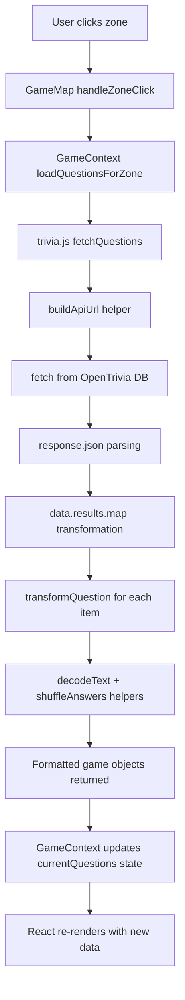

# Session 5 — Generating Dynamic Questions

Connecting to Real APIs 🌐

You're about to connect your trivia game to the real internet! This guide walks you through fetching live trivia questions from external APIs, transforming API data into game-ready format, and experiencing the power of asynchronous programming. Ready to make your zones come alive with real questions? Let's go!

## Table of Contents

- [Access Your Codespace](#access-your-codespace)
- [Understanding APIs and External Data](#understanding-apis-and-external-data)
- [Exploring the OpenTrivia Database](#exploring-the-opentrivia-database)
- [Understanding Asynchronous Programming](#understanding-asynchronous-programming)
- [Building the Fetch Foundation](#building-the-fetch-foundation)
- [Transforming API Data](#transforming-api-data)
- [Testing Your API Integration](#testing-your-api-integration)
- [Understanding the Complete Data Flow](#understanding-the-complete-data-flow)
- [Essential Terms](#essential-terms)
- [Ask the AI](#ask-the-ai)

<a id="access-your-codespace"></a>

## ☁️ Access Your Codespace

Visit [github.com/codespaces](https://github.com/codespaces) to relaunch your Codespace from Session 4.

<a id="understanding-apis-and-external-data"></a>

## 🌐 Understanding APIs and External Data

Before we start coding, let's understand what **APIs** are and why they're everywhere in modern web development.

**API** stands for **Application Programming Interface** — it's like a menu at a restaurant. The menu tells you what dishes are available, what ingredients they contain, and how much they cost, but it's not the actual food. Similarly, an API tells you what data is available, how to request it, and what format you'll receive, but it's not the data itself.

### 💡 Why This Matters

**APIs** are the backbone of modern web applications. Your trivia game will use the **OpenTrivia Database API** to fetch real questions from the internet, making your game dynamic and engaging with fresh content.

### 🏆 Bonus Challenge

Think of three apps you use daily — can you identify what external data they might be fetching through APIs?

<a id="exploring-the-opentrivia-database"></a>

## 🔍 Exploring the OpenTrivia Database

Let's explore the **API** that will power your trivia questions and see what real **API** data looks like.

1. **Visit the API endpoint**: Open [https://opentdb.com/api.php?amount=3&category=18&type=multiple&difficulty=easy&encode=url3986](https://opentdb.com/api.php?amount=3&category=18&type=multiple&difficulty=easy&encode=url3986) in your browser

2. **Examine the raw JSON response**: You'll see something like this:

   ```json
   {
     "response_code": 0,
     "results": [
       {
         "type": "multiple",
         "difficulty": "easy", 
         "category": "Science%3A%20Computers",
         "question": "What%20does%20GHz%20stand%20for%3F",
         "correct_answer": "Gigahertz",
         "incorrect_answers": [
           "Gigahotz",
           "Gigahetz", 
           "Gigahatz"
         ]
       }
     ]
   }
   ```

3. **Notice the encoding**: See those `%20` and `%3A` symbols? That's **URL encoding** — a way to safely transmit text over the internet

4. **Understand the structure**: Each question has a `question`, `correct_answer`, and `incorrect_answers` array

### 💡 Why This Matters

**JSON** (JavaScript Object Notation) is the universal language of **APIs**. It's how different applications share structured data over the internet. Your job as a developer is to transform this raw data into the format your game needs.

**📚 API Documentation:** For complete details about OpenTrivia Database parameters, response codes, and features, visit: [https://opentdb.com/api_config.php](https://opentdb.com/api_config.php)

### API Data Transformation Journey

```
Raw API Data → Your Transform Function → Game-Ready Data
```

**Before (API Response):**
```json
{
  "question": "What%20does%20GHz%20stand%20for%3F",
  "correct_answer": "Gigahertz",
  "incorrect_answers": ["Gigahotz", "Gigahetz", "Gigahatz"]
}
```

**After (Your Game Format):**
```json
{
  "question": "What does GHz stand for?",
  "answers": ["Gigahotz", "Gigahertz", "Gigahetz", "Gigahatz"],
  "correct": 1
}
```

<a id="understanding-asynchronous-programming"></a>

## ⏰ Understanding Asynchronous Programming

Now let's understand **asynchronous programming** — the key to working with **APIs** and external data.

**Synchronous** code runs line by line, waiting for each operation to complete before moving to the next. **Asynchronous** code can start a task (like fetching data from the internet) and continue with other work while waiting for the result.

### Real-World Analogy

Synchronous is like ordering at a fast-food counter where you wait for your entire order before the next person can order. Asynchronous is like a coffee shop where you order, get a number, and sit down while they prepare your drink — other customers can order while you wait.

### 💡 Why This Matters

Fetch requests to **APIs** are asynchronous because network requests take time. Your app needs to stay responsive while waiting for data from the internet. **Async/await** syntax makes asynchronous code easier to read and debug.

<a id="building-the-fetch-foundation"></a>

## ⚠️ Hot Module Reloading (HMR) Note

When you make changes to `trivia.js`, you may see these behaviors:

- Game returns to splash screen (normal)
- "useGame must be used within a GameProvider" error (also normal)

**How to fix and continue:**

1. **Refresh the browser page** manually (Ctrl+R or Cmd+R)
2. **Navigate back to the game** (click "Start Game")
3. **Click a zone** to test your updated code

**Pro tip:** Make several changes to your code, then refresh once to test them all together!

## 🔧 Building the Fetch Foundation

Time to connect your game to the real internet! Let's implement the core **fetch** logic.

1. **Open `src/services/trivia.js`**
2. **Replace the alert** with basic **fetch** logic:

   ```javascript
   try { // Add fetch logic
     console.log("Fetching from:", url);
     const response = await fetch(url);
     const data = await response.json();
     console.log("Raw API data:", data);
   } catch (error) {
     console.log("Failed to fetch questions:", error);
     return [];
   }
   ```

3. **Test your changes**:

   - **Open DevTools**: Press F12 or right-click → Inspect
   - **Navigate back to the game** (click "Start Game")
   - **Click a zone** to test your updated code
   - **Check the Console tab** to see your fetch in action
   - **Check the Network tab** to see the actual HTTP request

4. **Add data validation** immediately after getting the data:

   ```javascript
   if (!data.results || data.results.length === 0) { // Add validation
     console.log("No questions received from API");
     return [];
   }
   ```

### 💡 Why This Matters

**Error handling** and **data validation** are crucial when working with external **APIs**. Networks can fail, **APIs** can be down, or responses might be empty. Professional developers always plan for these scenarios to create robust applications.

<a id="transforming-api-data"></a>

## 🔄 Transforming API Data

Now let's transform the **API** data into game-ready format. This is where the real magic happens!

1. **Add transformation testing** after the validation check:

   ```javascript
   const firstQuestion = data.results[0]; // Add test code
   console.log("Before transform:", firstQuestion);
   
   const transformed = transformQuestion(firstQuestion);
   console.log("After transform:", transformed);
   ```

   **Test**: Save → Start Game → Click zone → See `undefined` in console → "We need to implement transformQuestion"

2. **Extract object properties** in the `transformQuestion` function:

   ```javascript
   function transformQuestion(apiQuestion) { // Add extraction
     const question = apiQuestion.question;
     const incorrectAnswers = apiQuestion.incorrect_answers;
     const correctAnswer = apiQuestion.correct_answer;
     
     console.log("Extracted properties:", { question, incorrectAnswers, correctAnswer });
   }
   ```

   **Test**: Save → Start Game → Click zone → See extracted properties in console

3. **Add helper functions for decoding**:

   ```javascript
   function transformQuestion(apiQuestion) {
     const question = decodeText(apiQuestion.question); // Add decoding
     const incorrectAnswers = apiQuestion.incorrect_answers.map(answer => decodeText(answer)); // Add decoding
     const correctAnswer = decodeText(apiQuestion.correct_answer); // Add decoding
     
     console.log("Decoded data:", { question, incorrectAnswers, correctAnswer });
   }
   ```

   **Test**: Save → Start Game → Click zone → See decoded, formatted data

   You should now see formatted game data like:
   ```json
   {
     "question": "What does GHz stand for?",
     "incorrectAnswers": ["Gigahotz", "Gigahetz", "Gigahatz"],
     "correctAnswer": "Gigahertz"
   }
   ```

4. **Add shuffling and index finding**:

   ```javascript
   function transformQuestion(apiQuestion) {
     const question = decodeText(apiQuestion.question);
     const incorrectAnswers = apiQuestion.incorrect_answers.map(answer => decodeText(answer));
     const correctAnswer = decodeText(apiQuestion.correct_answer);
     const shuffledAnswers = shuffleAnswers(correctAnswer, incorrectAnswers); // Add shuffling
     const correctIndex = shuffledAnswers.indexOf(correctAnswer); // Find correct index
     
     console.log("Shuffled answers:", shuffledAnswers);
     console.log("Correct answer is at index:", correctIndex);
   }
   ```

   **Test**: Save → Start Game → Click zone → See shuffled answers

5. **Return the final game object**:

   ```javascript
   function transformQuestion(apiQuestion) {
     const question = decodeText(apiQuestion.question);
     const incorrectAnswers = apiQuestion.incorrect_answers.map(answer => decodeText(answer));
     const correctAnswer = decodeText(apiQuestion.correct_answer);
     const shuffledAnswers = shuffleAnswers(correctAnswer, incorrectAnswers);
     const correctIndex = shuffledAnswers.indexOf(correctAnswer);
   
     return { // Return game object
       question: question,
       answers: shuffledAnswers,
       correct: correctIndex
     };
   }
   ```

   **Test**: Save → Start Game → Click zone → See complete transformed object!

   You should now see complete game data like:
   ```json
   {
     "question": "What does CPU stand for?",
     "answers": [
       "Central Process Unit",
       "Computer Personal Unit", 
       "Central Processing Unit",
       "Central Processor Unit"
     ],
     "correct": 2
   }
   ```

6. **Complete the fetchQuestions integration** by replacing the test logging:

   ```javascript
   const questions = data.results.map(apiQuestion => transformQuestion(apiQuestion)); // Transform all questions
   console.log("All transformed questions:", questions);
   return questions;
   ```

   **Test**: Click zone → see array of properly formatted questions!

### 💡 Why This Matters

**Data transformation** is a core skill in web development. APIs rarely return data in exactly the format your application needs. The `map()` method is perfect for transforming arrays of data, and helper functions keep your code clean and reusable.

<a id="testing-your-api-integration"></a>

## 🧪 Testing Your API Integration

Let's test your complete **API** integration and clean up the debugging code.

1. **Remove console logs** from your functions to clean up the code:

   ```javascript
   export async function fetchQuestions(zoneId, count = null) {
     const zone = getZoneById(zoneId);
     if (!zone) return [];
   
     const questionCount = count || zone.questionCount;
     const url = buildApiUrl(zone, questionCount);
   
     try {
       const response = await fetch(url);
       const data = await response.json();
   
       if (!data.results || data.results.length === 0) {
         return [];
       }
   
       const questions = data.results.map(apiQuestion => transformQuestion(apiQuestion));
       return questions;
   
     } catch (error) {
       console.log("Failed to fetch questions:", error);
       return [];
     }
   }
   ```

2. **Test the final integration**:

   - Game resets to splash screen
   - **Navigate to the game** (click "Start Game")
   - **Click different zones** to test various categories and difficulties
   - **Verify the data flow** using React DevTools:
     - **Open DevTools** → Components tab
     - **Find GameProvider** and examine `currentQuestions` state
     - **Click zones** and watch the state populate with your transformed questions

### 💡 Why This Matters

**Testing** is crucial in web development. You've just built a complete API integration that fetches real data from the internet, transforms it, and feeds it into your game's state management system. This is the foundation that will power your quiz functionality in future sessions.

<a id="understanding-the-complete-data-flow"></a>

## 🔄 Understanding the Complete Data Flow

Let's trace the complete journey from zone click to loaded questions:



### Data Transformation Flow

```text
┌─────────────────────────────────────────────────────────────────┐
│                    API Response (Raw)                           │
├─────────────────────────────────────────────────────────────────┤
│ {                                                               │
│   "question": "What%20does%20GHz%20stand%20for%3F",             │
│   "correct_answer": "Gigahertz",                                │
│   "incorrect_answers": ["Gigahotz", "Gigahetz", "Gigahatz"]     │
│ }                                                               │
└─────────────────────────────────────────────────────────────────┘
                                │
                                ▼
┌─────────────────────────────────────────────────────────────────┐
│                 transformQuestion Function                      │
├─────────────────────────────────────────────────────────────────┤
│ 1. decodeText() → Decode URL encoding                           │
│ 2. map() → Transform incorrect answers array                    │
│ 3. shuffleAnswers() → Randomize answer order                    │
│ 4. indexOf() → Find correct answer position                     │
│ 5. Return formatted object                                      │
└─────────────────────────────────────────────────────────────────┘
                                │
                                ▼
┌─────────────────────────────────────────────────────────────────┐
│                   Game Format (Transformed)                     │
├─────────────────────────────────────────────────────────────────┤
│ {                                                               │
│   "question": "What does GHz stand for?",                       │
│   "answers": ["Gigahotz", "Gigahertz", "Gigahetz", "Gigahatz"], │
│   "correct": 1                                                  │
│ }                                                               │
└─────────────────────────────────────────────────────────────────┘
```

### 💡 Why This Matters

Understanding the complete data flow helps you debug issues and build more complex features. You've created a robust pipeline that handles API requests, data transformation, and state management — the same patterns used in professional web applications.

<a id="essential-terms"></a>

## 📚 Essential Terms

_Quick reference for all the API and asynchronous programming concepts you just learned:_

| Term | Definition | Why it matters |
|------|------------|----------------|
| 🌐 Application Programming Interface (API) | A set of rules and protocols that allows different software applications to communicate with each other. | Your trivia game uses the OpenTrivia Database API to fetch real questions, transforming static zones into dynamic content. |
| 📋 JSON | JavaScript Object Notation — a text format for exchanging structured data between applications. | OpenTrivia Database returns question data in JSON format, which your transformQuestion function converts to game format. |
| 📨 HTTP request | A message sent from your application to a server asking for specific data or resources. | Each zone click triggers an HTTP request to OpenTrivia Database with your zone's specific parameters. |
| 📡 Fetch API | A modern JavaScript interface for making HTTP requests to servers and APIs. | Your fetchQuestions function uses fetch to request trivia data based on each zone's category and difficulty settings. |
| 🔗 Uniform Resource Identifier (URI) | A string that uniquely identifies a resource on the internet, which can be the same as or part of a URL. | Your buildApiUrl function creates URIs that uniquely identify the OpenTrivia API endpoint with specific parameters for each zone. |
| 🔐 URL encoding | A method of converting characters into a format safe for transmission over the internet. | Question text comes URL-encoded from the API — your decodeText function converts it to readable game text. |
| ⏰ asynchronous programming | Code execution that doesn't block while waiting for operations to complete, allowing other code to run. | Your game stays responsive while fetching questions — users can still interact with the UI during network requests. |
| 🔄 async/await | JavaScript syntax that makes asynchronous code look and behave like synchronous code. | Your fetchQuestions function uses async/await to handle API requests in a readable, step-by-step manner. |
| 🤝 promise | A JavaScript object representing the eventual completion or failure of an asynchronous operation. | Every fetch call returns a promise — your game will eventually get questions or handle the error gracefully. |

<a id="ask-the-ai"></a>

## 🤖 Ask the AI — API Integration

You just built a complete API integration with data fetching, transformation, and error handling — excellent work!

Now let's deepen your understanding of APIs, asynchronous programming, and data transformation patterns. Here are the most impactful questions to ask your AI assistant about today's session:

- **What makes APIs so important in modern web development?**
- **Why do APIs often return data in formats that need transformation?**
- **What are the benefits of separating data fetching from data transformation?**
- **How does the Fetch API handle network errors and what should developers do about them?**
- **How do helper functions like `decodeText` and `shuffleAnswers` improve code quality?**
- **How does the return keyword work in JavaScript functions, and can you explain it with a non-tech example?**
- **What is functional programming?**

---

### 💬 Pro Tip:

API integration is a core skill for modern developers. The pattern you learned today — fetch data, validate response, transform format, handle errors — applies to almost every external API you'll work with. Master this flow and you can integrate with any service on the internet!