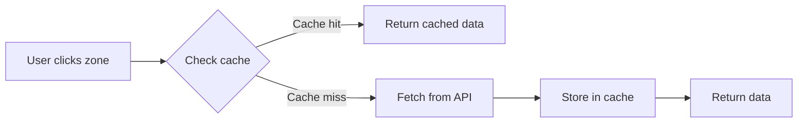

# Session 6 — Adding Question Caching

You're about to add browser storage and caching to your trivia game! This guide walks you through implementing localStorage to store API responses, building cache helper functions, and integrating caching into your existing fetch logic. Ready to make your game load instantly? Let's go!

## Table of Contents

- [Why Caching Matters](#why-caching-matters)
- [Browser Storage and localStorage](#browser-storage-and-localstorage)
- [Building Cache Helper Functions](#building-cache-helper-functions)
- [Updating fetchQuestions with Caching](#updating-fetchquestions-with-caching)
- [Testing Your Cache](#testing-your-cache)
- [Essential Terms](#essential-terms)
- [Ask the AI](#ask-the-ai)

<a id="accessing-your-codespace"></a>

#### ☁️ Accessing Your Codespace

Visit [github.com/codespaces](https://github.com/codespaces) to relaunch your Codespace from the previous session.

<a id="why-caching-matters"></a>

## ⚡ Why Caching Matters

**Caching** stores data locally so you don't need to fetch it repeatedly. Right now, every zone click triggers a network request to the OpenTrivia Database. This creates four problems:

1. **Slow loading** - Network requests take time (milliseconds to seconds)
2. **Wasted bandwidth** - Downloading identical questions repeatedly
3. **Rate limiting** - APIs restrict request frequency (OpenTrivia allows one request per 5 seconds)
4. **Poor experience** - Users wait for content they've already seen

**The solution:** Store API responses in the browser. When users click a zone they've visited before, your game returns cached questions instantly instead of making a network request.

> 💡 **Caching Across the Web**
>
> Every major web application uses **caching** to improve performance. YouTube caches video thumbnails, Netflix caches show metadata, Instagram caches images. Your trivia game will cache question sets, applying the same performance optimization technique used across the web.

<a id="browser-storage-and-localstorage"></a>

## 🗄️ Browser Storage and localStorage

The browser provides several storage mechanisms for saving data locally. Your game uses `localStorage`, a specific browser storage API that persists **key-value pairs** across sessions. Unlike temporary data that vanishes on page refresh, `localStorage` data persists until explicitly removed — surviving browser restarts and even computer shutdowns.

### Common Use Cases for localStorage:

- **User preferences** - Theme, language, font size
- **Game progress** - Completed levels, high scores, settings
- **Form data** - Draft messages, shopping cart contents
- **API responses** - Cached data for faster loading

### localStorage Operations:

| Operation         | Code                                        |
|-------------------|---------------------------------------------|
| **Create/Update** | `localStorage.setItem('key', 'value')`      |
| **Read**          | `const value = localStorage.getItem('key')` |
| **Delete**        | `localStorage.removeItem('key')`            |
| **Check**         | `if (localStorage.getItem('key')) { ... }`  |

### The String-Only Limitation

`localStorage` has one important constraint: **it only stores strings**. This means you can't directly save JavaScript objects or arrays. To store your question data (which is an array of objects), you need two conversion processes:

**Serialization** converts JavaScript data into a string format for storage:

```javascript
const data = [{ question: "What is RAM?", answers: [...] }];  // [1] Data
const text = JSON.stringify(data);                            // [2] Convert
localStorage.setItem('trivia_zone_0', text);                  // [3] Store
```

**Deserialization** converts the stored string back into its original data structure:

```javascript
const text = localStorage.getItem('trivia_zone_0');  // [1] Retrieve
const data = JSON.parse(text);                       // [2] Convert back
```

Think of **serialization** like packing a suitcase for storage — you're converting items into a compact, storable format. **Deserialization** is unpacking that suitcase to get your original items back.

> 💡 **Why JSON for Serialization?**
>
> JSON (JavaScript Object Notation) is the standard format for **serialization** because it's human-readable, compact, and JavaScript has built-in methods (`JSON.stringify()` and `JSON.parse()`) for conversion. The string format can be stored anywhere, then converted back into its original structure whenever you need it.


<a id="building-cache-helper-functions"></a>

## 🔧 Building Cache Helper Functions

🎯 **Goal:** Create three helper functions that handle localStorage operations for caching questions.

**File:** `src/services/trivia.js`

Helper functions abstract `localStorage` complexity into clean, reusable pieces. You'll build three functions that work together:

| Function | Purpose | Key Operation |
|----------|---------|---------------|
| `getCacheKey` | Creates unique identifiers | Generates consistent cache keys |
| `getCachedQuestions` | Retrieves stored data | **Deserialization** with `JSON.parse()` |
| `setCachedQuestions` | Stores new data | **Serialization** with `JSON.stringify()` |

### Step 1: Add key generation

Add the `getCacheKey` function after the existing helper functions (`decodeText`, `shuffleAnswers`, etc.).

```javascript
// After existing helper functions, add:

function getCacheKey(zoneId) {                 // [1] Accept zone ID
  return `trivia_questions_zone_${zoneId}`;    // [2] Build unique key
}
```

> 💡 **Understanding Key Generation**
>
> 1. **Accept zone ID**: Function takes the zone identifier as input
> 2. **Build unique key**: Creates keys like `trivia_questions_zone_0`, `trivia_questions_zone_1`, etc.
>
> Consistent key generation ensures you always look up the same cache entry for each zone.

### Step 2: Add cache retrieval

Add the `getCachedQuestions` function after `getCacheKey`.

```javascript
function getCachedQuestions(zoneId) {          // [1] Accept zone ID
  const key = getCacheKey(zoneId);             // [2] Get cache key
  const cached = localStorage.getItem(key);    // [3] Retrieve from storage
  return cached ? JSON.parse(cached) : null;   // [4] Parse or return null
}
```

> 💡 **Understanding Cache Retrieval**
>
> 1. **Accept zone ID**: Function takes the zone identifier as input
> 2. **Get cache key**: Use `getCacheKey()` to create the correct key
> 3. **Retrieve from storage**: Get the stored string from `localStorage` (or `null` if not found)
> 4. **Parse or return null**: If data exists, parse JSON to JavaScript object; otherwise return `null`
>
> The **ternary operator** `cached ? JSON.parse(cached) : null` handles both cases in one line.

### Step 3: Add cache storage

Add the `setCachedQuestions` function after `getCachedQuestions`.

```javascript
function setCachedQuestions(zoneId, questions) {          // [1] Accept parameters
  const key = getCacheKey(zoneId);                        // [2] Get cache key
  localStorage.setItem(key, JSON.stringify(questions));   // [3] Serialize
}
```

> 💡 **Understanding Cache Storage**
>
> 1. **Accept parameters**: Function takes the zone identifier and questions array as input
> 2. **Get cache key**: Use `getCacheKey()` to create the correct key
> 3. **Serialize and store**: `localStorage` only stores strings, so `JSON.stringify()` converts the questions array to text format before storage
>
> This pattern — wrapping complex operations in simple functions — is called **abstraction** and makes code easier to test, debug, and maintain.

<a id="updating-fetchquestions-with-caching"></a>

## 🔄 Updating fetchQuestions with Caching

🎯 **Goal:** Integrate cache functions into `fetchQuestions` to check cache before fetching and store results after fetching.

**File:** `src/services/trivia.js`

You'll add caching to `fetchQuestions` in two places: check cache at the start, store results at the end.

### Step 1: Add cache checking

Add cache checking at the beginning of `fetchQuestions`, before the zone lookup.

```javascript
export async function fetchQuestions(zoneId, count = null) {
  // Add cache check:
  const cachedQuestions = getCachedQuestions(zoneId);  // [1] Check cache
  if (cachedQuestions) {                               // [2] If found
    console.log(`Cache hit for zone ${zoneId}`);       // [3] Log hit
    return cachedQuestions;                            // [4] Return early
  }

  console.log(`Cache miss for zone ${zoneId}`);        // [5] Log miss

  const zone = getZoneById(zoneId);
  // ... rest of existing code ...
}
```

> 💡 **Understanding Cache Checking**
>
> 1. **Check cache**: Call `getCachedQuestions()` to see if we have stored questions for this zone
> 2. **If found**: **Cache hit** — we have the data already
> 3. **Log hit**: Record the cache hit for debugging
> 4. **Return early**: Skip the entire API request and return cached data immediately
> 5. **Log miss**: If cache is empty, record the miss before fetching from API
>
> The early return in step 4 is crucial — it prevents the expensive API request from executing when cached data exists. If `getCachedQuestions()` returns `null` (**cache miss**), execution continues past the if block to fetch fresh data.

**✓ You should see:** When clicking a zone for the first time, console shows `Cache miss for zone X`.

### Step 2: Add cache storage

Add cache storage after the data transformation, before the return statement.

```javascript
export async function fetchQuestions(zoneId, count = null) {
  // ... existing code ...
  
  try {
    const response = await fetch(url);
    const data = await response.json();

    const questions = data.results.map((apiQuestion) =>
      transformQuestion(apiQuestion)
    );

    // Add cache storage:
    setCachedQuestions(zoneId, questions);  // Store questions for this zone

    return questions;
  } catch (error) {
    console.log("Failed to fetch questions:", error);
    return [];
  }
}
```

> 💡 **Understanding Cache Storage**
>
> After successfully fetching and transforming questions from the API, call `setCachedQuestions()` to store them in `localStorage`. The next time this zone is clicked, Step 1's cache check will find this stored data and return it immediately, skipping the API request entirely.

**✓ You should see:** After clicking a zone, clicking it again shows `Cache hit for zone X` in console.

<a id="testing-your-cache"></a>

## 🧪 Testing Your Cache

🎯 **Goal:** Verify your caching system works by observing cache misses, hits, and persistence using DevTools.

You'll test the complete caching flow: first load (cache miss), repeat load (cache hit), browser refresh (persistence), and manual clear (cache reset).



### Step 1: Open DevTools and clear existing cache

Press `F12` or right-click → Inspect to open your browser's developer tools.

**Navigate to the storage panel:**

| Browser | Storage Location |
|---------|------------------|
| Chrome/Edge | Application tab → Local Storage |
| Firefox | Storage tab → Local Storage |
| Safari | Storage tab → Local Storage |

- In the sidebar, **expand** Local Storage
- **Click** your site's domain (e.g., `http://localhost:5173`)
- If any `trivia_questions_zone_` entries exist, **right-click** each → Delete

**✓ You should see:** Local Storage panel with no trivia cache entries.

### Step 2: Observe a cache miss

Test the first-time load behavior when no cached data exists.

- **Click** "Start Game" and click any zone for the first time
- In the **Console tab** (same DevTools panel), **look** for `Cache miss for zone X`
- In the Local Storage panel, **observe**:
  - A new entry appears: `trivia_questions_zone_0`
  - It contains **serialized** JSON data
- **Click** the entry to inspect the cached questions

**✓ You should see:** Console shows cache miss, Local Storage shows new entry with question data.

### Step 3: Confirm a cache hit

Test the repeat load behavior when cached data exists.

- **Click** the same zone again
- In the Console tab, **look** for `Cache hit for zone X`
- In the Local Storage panel, **verify**:
  - The entry remains unchanged
  - No new network request in Network tab

**✓ You should see:** Console shows cache hit, questions load instantly, no API request.

### Step 4: Test cache persistence

Verify cached data survives browser refresh.

- **Refresh** the browser (`Ctrl+R` or `Cmd+R`)
- **Click** "Start Game" and click the same zone
- **Observe**:
  - Console shows `Cache hit for zone X`
  - Local Storage entry still present

**✓ You should see:** Cached data persists after refresh, questions still load instantly.

### Step 5: Test cache reset

Verify the system handles cache deletion correctly.

- In the Local Storage panel, **right-click** the cache entry → Delete
- **Click** the zone again
- **Observe**:
  - Console shows `Cache miss for zone X`
  - Entry repopulates with fresh data

**✓ You should see:** After deletion, system fetches fresh data and recreates cache entry.

> 💡 **Debugging with DevTools**
>
> You've learned to trace data flow through your application by watching console logs, inspecting browser storage, and monitoring network requests. This debugging approach — following the digital breadcrumbs your code leaves behind — is how developers diagnose crashes, performance issues, and unexpected behavior. These skills apply to any web application you build.

> ℹ️ **The Cache-Aside Pattern**
>
> You've implemented the **cache-aside pattern** used across modern applications: check cache first, on **cache miss** fetch from source, store result in cache, return data. This pattern (check in Step 1, store in Step 2) ensures your game only makes API requests when necessary. You just verified this pattern works by observing cache misses, hits, and persistence.

<a id="essential-terms"></a>

## 📚 Essential Terms

_Quick reference for all the caching and browser storage concepts you just learned:_

| Term   | Definition | Why it matters |
|--------|------------|----------------|
| ⚡ caching | Storing frequently accessed data in fast storage to avoid expensive operations like network requests. | Makes your game feel instant and responsive by eliminating repeated API calls for the same questions. |
| 🚦 rate limiting | API restrictions on request frequency to prevent server overload and ensure fair usage. | OpenTrivia Database limits requests to once every 5 seconds — caching helps avoid these limits. |
| 💾 localStorage | Browser storage API that persists data as key-value pairs across sessions and page refreshes. | Your trivia questions stay cached even after closing and reopening the browser, providing instant loading. |
| 🔑 key-value pairs | Data storage format where each piece of information has a unique identifier (key) and associated data (value). | `localStorage` uses this format: your cache keys identify zones, values contain question data. |
| 📦 serialization | Converting JavaScript objects into text format for storage using JSON.stringify(). | `localStorage` only stores strings, so your question objects must be serialized before storage. |
| 🔄 deserialization | Converting stored text back into JavaScript objects using JSON.parse(). | Transforms cached text back into usable question objects for your game. |
| 🎯 cache hit | When requested data is found in cache and can be returned immediately without external requests. | Your zones load instantly on subsequent clicks, providing smooth user experience. |
| 🔍 cache miss | When requested data is not in cache and must be fetched from the original source. | Triggers API request to OpenTrivia Database and stores result for future cache hits. |
| ❓ ternary operator | Concise conditional syntax using ? and : for simple if/else logic in expressions. | Used in your cache retrieval: `cached ? JSON.parse(cached) : null` — clean and readable. |

<a id="ask-the-ai"></a>

## 🤖 Ask the AI — Adding Question Caching

You just built your first caching system with localStorage and helper functions — great work!

Here are some key questions to ask your AI assistant to deepen your understanding of what you just built:

- **Why is caching so important for web apps and user experience?**
- **What happens when I use JSON.stringify and JSON.parse with my question data?**
- **Why do we need helper functions like getCacheKey and getCachedQuestions?**
- **What would happen if I didn't have caching in my trivia game?**
- **How can I use the browser DevTools to debug localStorage issues?**

