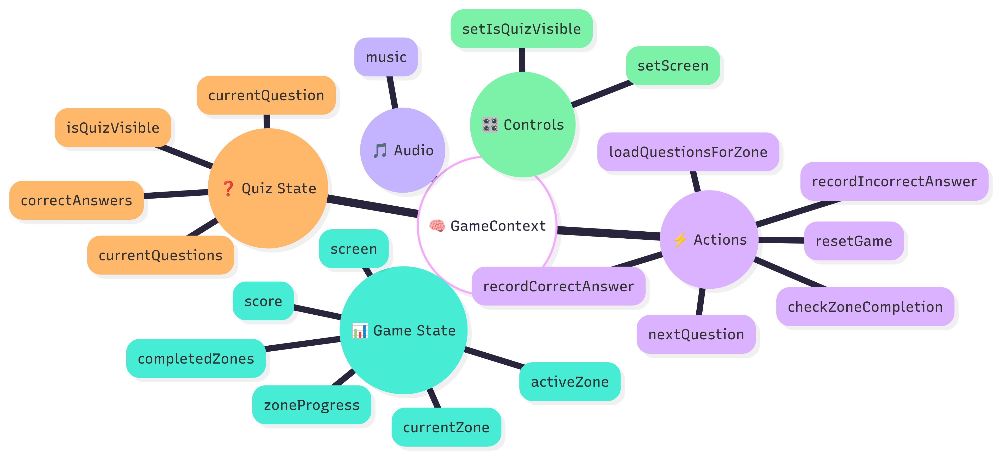

# Session 8 — Implementing Scoring & Victory

You're about to add the most satisfying part of any game — scoring and victory! This guide walks you through implementing a complete scoring system, managing complex application state, and creating your first independent React component. Ready to make your trivia game feel like a real achievement? Let's go!

## Table of Contents

- [Application State](#application-state)
- [Adding Score Tracking](#adding-score-tracking)
- [Implementing Score Updates](#implementing-score-updates)
- [Adding Cache Clearing](#adding-cache-clearing)
- [Solo Mission: GameOver Component](#solo-mission-gameover-component)
- [Essential Terms](#essential-terms)
- [Ask the AI](#ask-the-ai)

<a id="accessing-your-codespace"></a>

## ☁️ Accessing Your Codespace

Visit [github.com/codespaces](https://github.com/codespaces) to relaunch your Codespace from Session 7.

<a id="application-state"></a>

## 🧠 Application State

Before we dive into scoring, let's understand how **application state** differs from the component state you've used before.

**Application state** is the complete picture of your game's current condition — everything from the player's score to which zones are completed. Think of it as your game's "save file" that tracks all progress and achievements.

Your `GameContext` manages five categories of state:

| Category | Purpose | Examples |
|----------|---------|----------|
| **Game State** | Core game progress | `score`, `screen`, `zoneProgress` |
| **Quiz State** | Current quiz session | `currentQuestions`, `currentQuestion`, `correctAnswers` |
| **Audio** | Sound controls | `music` settings |
| **Actions** | Game logic functions | `recordCorrectAnswer`, `resetGame` |
| **Controls** | UI state setters | `setScreen`, `setIsQuizVisible` |

Think of your `GameContext` as the brain of your game — it keeps track of everything that's happening behind the scenes. The `useGame` hook provides access to this brain from any component that needs it. The mind map below breaks down how your game's state is organized, with a spotlight on **actions** — these are the functions that drive your game logic and help different parts of your app work together:


*Figure: GameContext Mind Map*

Managing application state is what separates simple websites from complex, interactive applications. Your scoring system will coordinate multiple pieces of state to create a cohesive game experience where every action has consequences and every achievement is tracked.

<a id="adding-score-tracking"></a>

## 🏆 Adding Score Tracking

🎯 **Goal:** Add a scoring system that tracks player performance and displays it prominently in your game's HUD.

You'll add score state to GameContext, expose it through the Context value, create a Scoreboard component, and integrate it into the HUD.

### Step 1: Add score state

**File:** `src/context/GameContext.jsx`

Add score state to track player performance throughout the game.

```javascript
export function GameProvider({ children }) {
  const [screen, setScreen] = useState(SCREENS.SPLASH);
  const [score, setScore] = useState(0);  // Add score state
  
  // ... rest of state declarations
```

> 💡 **Understanding useState**
>
> `useState` is a React hook that lets your component remember things — like a score — between renders. It gives you:
>
> - **A current value** (`score`) that starts at `0`
> - **A setter function** (`setScore`) that can be used to update the value and trigger a re-render

### Step 2: Share score with all components

**File:** `src/context/GameContext.jsx`

Make score available to all components by adding it to the Context value object.

```javascript
export function GameProvider({ children }) {
  // ... state declarations ...
  
  return (
    <GameContext
      value={{
        // GAME STATE
        screen,
        score,  // Add score to value
        zoneProgress,
        // ... rest of properties
      }}
    >
      {children}
    </GameContext>
  );
}
```

> 💡 **Understanding How State Is Shared**
>
> In Step 1, you created `score` as local state.
>
> By adding it to the Context value here, you make it available across your app.
>
> Now any component that calls `useGame()` can access `score` — no prop-drilling needed.

### Step 3: Create Scoreboard component

**File:** `src/components/HUD.jsx`

Create a new component that displays the score from shared state.

```javascript
// Add import at top of file:
import { useGame } from "../hooks/useGame";  // [1] Import useGame hook

// Add after imports:
function Scoreboard() {
  const { score } = useGame();  // [2] Get score from shared state
  return <div className="score-display">Score: {score}</div>;  // [3] Display score
}
```

> 💡 **Understanding Shared State Access**
>
> 1. **Import useGame hook**: Access the shared game state from Context
> 2. **Get score from shared state**: Destructure the score value from GameContext
> 3. **Display score**: Render the score in a styled div
>
> The Scoreboard component accesses the score directly from shared state using the `useGame` hook. This means any component can display or use the score without passing it through props. When the score updates in GameContext, all components using it automatically re-render with the new value.

### Step 4: Add Scoreboard to HUD

**File:** `src/components/HUD.jsx`

Update the HUD component to render both Scoreboard and CurrentZone using a React Fragment.

```javascript
// Before:
export default function HUD() {
  return <CurrentZone />;
}

// After:
export default function HUD() {
  return (
    <>
      <Scoreboard />
      <CurrentZone />
    </>
  );
}
```

### Step 5: Test score display

Navigate to the game screen.

**✓ You should see:** "Score: 0" appears in the HUD above the current zone display.

<a id="implementing-score-updates"></a>

## 📊 Implementing Score Updates

🎯 **Goal:** Make the score change based on player performance with point rewards and penalties.

**File:** `src/context/GameContext.jsx`

You'll update the `recordCorrectAnswer` and `recordIncorrectAnswer` functions to modify the score when players answer questions.

### Step 1: Add points for correct answers

Update the `recordCorrectAnswer` function to award points when players answer correctly.

```javascript
const recordCorrectAnswer = () => {
  setCorrectAnswers((prev) => prev + 1);
  setScore((prev) => prev + POINTS_PER_CORRECT);  // Add points
};
```

> 💡 **Understanding Updater Functions**
>
> `setScore((prev) => prev + POINTS_PER_CORRECT)` uses an **updater function** — a way to update state based on what it was before.
>
> Instead of giving React a new value directly, you give it a function. That function gets the current value (`prev`) and returns the updated one. This is super useful when the new value depends on the old one — like adding points to a score.

### Step 2: Add point deduction for incorrect answers

Update the `recordIncorrectAnswer` function to deduct points, preventing negative scores.

```javascript
const recordIncorrectAnswer = () => {
  setScore((prev) => Math.max(0, prev - POINTS_PER_CORRECT));  // Deduct points
};
```

> 💡 **Understanding Math.max for Score Boundaries**
>
> `Math.max(0, prev - POINTS_PER_CORRECT)` keeps the score from dropping below zero. It compares the result of the subtraction with `0` and returns whichever is higher.
>
> That way, if the player doesn't have enough points to lose, their score just stays at zero.

### Step 3: Reset score on game reset

Update the `resetGame` function to reset the score back to zero when players start over.

```javascript
const resetGame = () => {
  setScore(0);  // Reset score to zero
  setZoneProgress({
    0: { completed: false },
    1: { completed: false },
    2: { completed: false },
  });
  setIsQuizVisible(false);
  setCurrentQuestions([]);
  setCurrentQuestion(0);
  setCorrectAnswers(0);
};
```

### Step 4: Test score updates

Click a zone, then answer questions.

**✓ You should see:**

- Score starts at 0 when game begins
- Correct answer → Score increases by 100 points
- Incorrect answer → Score decreases by 100 points (but never below 0)

<a id="adding-cache-clearing"></a>

## 🗄️ Adding Cache Clearing

🎯 **Goal:** Add cache clearing functions to remove stored questions when zones are completed or the game resets.

You'll build two helper functions — one to clear a single zone's cache, and one to clear all cached questions — then use them when zones are completed and when the game resets.

### Step 1: Create cache clearing functions

**File:** `src/services/trivia.js`

Add the cache clearing functions at the end of the file.

```javascript
// Add clearQuestionCache function:
export function clearQuestionCache(zoneId) {
  const key = getCacheKey(zoneId);             // [1] Get cache key
  localStorage.removeItem(key);                // [2] Remove from storage
}

// Add clearAllQuestionCache function:
export function clearAllQuestionCache() {
  Object.keys(localStorage)                                    // [3] Get all keys
    .filter((key) => key.startsWith("trivia_questions_zone_")) // [4] Filter keys
    .forEach((key) => localStorage.removeItem(key));           // [5] Remove each
}
```

> 💡 **Understanding Cache Clearing**
>
> 1. **Get cache key**: Use `getCacheKey()` to create the correct key for this zone
> 2. **Remove from storage**: Delete the cache entry using `localStorage.removeItem()`
> 3. **Get all keys**: `Object.keys(localStorage)` returns array of all localStorage keys
> 4. **Filter keys**: Keep only keys starting with `"trivia_questions_zone_"`
> 5. **Remove each**: Delete each matching cache entry
>
> The `clearAllQuestionCache` function uses method chaining to find and remove all trivia-related cache entries without affecting other localStorage data your app might use.

### Step 2: Import cache functions into GameContext

**File:** `src/context/GameContext.jsx`

Update your import to include the cache clearing functions.

```javascript
// Before:
import { fetchQuestions } from "../services/trivia";

// After:
import { 
  fetchQuestions, 
  clearQuestionCache, 
  clearAllQuestionCache 
} from "../services/trivia";
```

### Step 3: Clear cache on zone completion

**File:** `src/context/GameContext.jsx`

Update the `checkZoneCompletion` function to clear the zone's cache when players pass, ensuring fresh questions if they replay.

```javascript
const checkZoneCompletion = () => {
  // ... existing validation and calculation logic ...

  if (passed) {
    setZoneProgress((prev) => ({
      ...prev,
      [activeZone]: { completed: true },
    }));
    
    clearQuestionCache(activeZone);  // Clear completed zone cache

    if (activeZone === ZONES.length - 1) {
      setScreen(SCREENS.GAME_OVER);
    }
  }
};
```

> 💡 **Understanding Cache Clearing on Completion**
>
> When players complete a zone, clearing its cache ensures they get fresh questions if they replay. Without this, replaying would show the exact same questions they just answered, reducing the challenge and interest.

### Step 4: Clear cache on game reset

**File:** `src/context/GameContext.jsx`

Update the `resetGame` function to clear all cached questions when players start over.

```javascript
const resetGame = () => {
  setScore(0);
  setZoneProgress({
    0: { completed: false },
    1: { completed: false },
    2: { completed: false },
  });
  setIsQuizVisible(false);
  setCurrentQuestions([]);
  setCurrentQuestion(0);
  setCorrectAnswers(0);
  clearAllQuestionCache();  // Clear all cached questions
};
```

> 💡 **Understanding Cache Clearing on Reset**
>
> Clearing all cached questions on game reset ensures players get fresh questions for every zone when they start a new game. This prevents stale data from previous games and provides a clean slate for new gameplay sessions.

### Step 5: Test cache clearing

Test both zone completion and game reset cache clearing.

**Test zone completion:**

- **Open** DevTools (`F12`) → Application/Storage tab → Local Storage
- **Complete** a zone by answering enough questions correctly
- **Observe** the localStorage panel

**✓ You should see:** The cache entry for the completed zone is removed from localStorage.

**Test game reset:**

- **Open** React DevTools → Components tab → Find `GameProvider`
- **Scroll** to hooks section → Find `resetGame` function
- **Click** the function icon to execute it
- **Check** localStorage panel in Application/Storage tab

**✓ You should see:** All cache entries are removed from localStorage.

<a id="solo-mission-gameover-component"></a>

## 🎖️ Solo Mission: GameOver Component

You've built components with guidance — now it's your turn to create a victory screen using the patterns you've practiced.

### What You're Building

A final screen that appears when the player completes all zones. It should display a congratulations message, show the final score, and offer a way to play again.

---

### Phase 1: Component Foundation

🎯 **Goal:** Set up the basic structure of your GameOver component

**Your Tasks:**

1. Create a new file: `src/components/GameOver.jsx`
2. Define a React component and export it as the default
3. In the component's return, include a div with `className="game-over"` that contains an h1 congratulating the player
4. In `App.jsx`, import your new GameOver component
5. Add a condition in `App.jsx` to render GameOver when `screen === SCREENS.GAME_OVER`

**Test:** Use React DevTools to manually set `screen` to `"gameover"` — the component should appear in the browser

---

### Phase 2: Score Display

🎯 **Goal:** Show the player's final score on the GameOver screen

**Your Tasks:**

1. Import the `useGame` hook at the top of `GameOver.jsx` from `"../hooks/useGame"`
2. Inside the component, use the hook and destructure `score`:
   ```javascript
   const { score } = useGame();
   ```
3. Below the congratulations h1, display the score in a div with `className="final-score"` using `{score}`

**Test:** Play the game to build up a score, then use React DevTools to set `screen` to `"gameover"` (like in Phase 1) to quickly view the score display

---

### Phase 3: Play Again Button

🎯 **Goal:** Let players restart the game from the GameOver screen

**Your Tasks:**

1. Add imports:
   - Import `SCREENS` from `"../constants/screens"`
   - Import `GameButton` from `"./GameButton"`
2. Inside the component, get `resetGame` and `setScreen` from `useGame()`
3. Write a click handler that resets the game and shows the splash screen:
   ```javascript
   const playAgain = () => {
     resetGame();
     setScreen(SCREENS.SPLASH);
   };
   ```
4. Below the final-score div, render the button with:
   - Text: "Play Again"
   - Variant: `"primary"`
   - Your click handler

**Test:** Use React DevTools to set `screen` to `"gameover"` (like in Phase 1), then click the button → returns to splash → score and zones reset

---

### ✅ Success Review

Your GameOver component should:

- Appear when the game ends
- Show a congratulations message
- Display the final score using `useGame()`
- Include a working "Play Again" button
- Support multiple full game cycles without issues

### 🔍 Reference Guide

- **SplashScreen.jsx** – Component structure, GameButton usage, click handlers, screen navigation
- **HUD.jsx** – Accessing score from `useGame()`
- **App.jsx** – Conditional rendering with SCREENS constants

<a id="essential-terms"></a>

## 📚 Essential Terms

_Quick reference for the key concepts you just learned:_

| Term   | Definition | Why it matters |
|--------|------------|----------------|
| 🏗️ application state | The complete condition of an application at a specific moment in time, encompassing all the information it needs to function correctly. | Your GameContext manages all application state — screen, score, zone progress — making it accessible to any component through useGame. |
| 🔄 updater function | A function passed to setState that receives the previous state value and returns the new state. | Essential for score calculations — ensures accurate updates even when React batches multiple state changes. |


<a id="ask-the-ai"></a>

## 🤖 Ask the AI — Implementing Scoring & Victory

You just implemented a complete scoring system, managed complex application state, and built your first independent React component — excellent work!

Now let's deepen your understanding of state management patterns, component architecture, and development practices. Here are the most impactful questions to ask your AI assistant about today's session:

- **How does application state differ from component state, and when should I use each?**
- **Why are updater functions important for state that depends on previous values?**
- **What are some common patterns for resetting application state in React apps?**
- **How do you decide what props a new component needs when building it from scratch?**
- **What are the benefits of breaking UI into small, focused components?**
