# Session 10 Instructor Guide: Version Control & Deployment

## Learning Outcomes

**By the end of Session 10, students will be able to:**

1. **Define version control** as a system for tracking file changes over time and explain the problems it solves
2. **Identify key version control terminology** including repository, commit, branch, and push
3. **Explain Git's role** as the most popular version control system used by developers worldwide
4. **Demonstrate repository setup** by disconnecting from starter repos and creating personal repositories
5. **Execute the Git workflow** using add, commit, and push commands to save and share changes
6. **Write meaningful commit messages** that describe changes clearly and concisely
7. **Configure GitHub authentication** using the GitHub CLI for secure repository access
8. **Define CI/CD concepts** including Continuous Integration and Continuous Deployment
9. **Explain GitHub Actions** as GitHub's automation platform for running workflows
10. **Configure GitHub Pages** to host static websites from repository content
11. **Navigate GitHub interface** including repository settings, Actions tab, and Pages configuration
12. **Implement automated deployment** using pre-configured GitHub Actions workflows
13. **Verify deployment success** by testing live applications and monitoring build processes
14. **Share deployed applications** using public URLs and understand the deployment lifecycle

## Instruction

**Instructor introduces key concepts students need to succeed:**

1. **Version Control Philosophy** - Define version control as essential infrastructure for software development, emphasizing safety, collaboration, and history tracking
2. **Git Ecosystem Overview** - Introduce Git as the industry standard, GitHub as the hosting platform, and the relationship between local and remote repositories
3. **Repository Ownership** - Guide students through disconnecting from starter repos and creating personal repositories for project ownership
4. **Git Workflow Fundamentals** - Demonstrate the add, commit, push cycle as the foundation of version control workflows
5. **Commit Message Best Practices** - Teach clear, descriptive commit messages as professional communication
6. **Authentication Setup** - Show GitHub CLI authentication for secure repository access
7. **CI/CD Introduction** - Explain automated processes as modern development practice for efficiency and reliability
8. **GitHub Actions Overview** - Describe GitHub's automation platform and its role in deployment workflows
9. **GitHub Pages Configuration** - Set up free static site hosting with automated deployment integration
10. **Deployment Verification** - Guide students through testing and monitoring deployment processes
11. **Project Configuration** - Review build settings and environment variables for deployment compatibility
12. **Let's Go Live!** - Launch the hands-on mission to publish student games to the internet using professional development workflows

---

## Slide Deck Outline

### **Slide 1: Version Control & Deployment 🚀**

- **Title:** "Session 10: Version Control & Deployment — Publishing Your Game"
- **Session 9 Recap:** "Last time: You built custom hooks with browser API integration and AI assistance"
- **Hook:** "Your game has awesome features — now let's share it with the world!"
- **Today's Mission:** Learn version control concepts, implement Git workflows, and deploy to the internet using automated CI/CD
- **Visual:** Git workflow diagram with deployment pipeline
- **Connection:** "From local development to live web application!"

### **Slide 2: Version Control - Your Code's Time Machine 📚**

- **Teaching Focus:** Why version control is essential for any serious development
- **Key Concepts:**
  - **Version control** as a system tracking file changes over time
  - **Problem-solving tool** for "it worked yesterday" and collaboration challenges
  - **Git** as the industry-standard version control system
  - **Repository** as project home containing code and complete history
- **Problems Version Control Solves:**
  - **Lost work** - Complete change history prevents data loss
  - **Breaking changes** - Rollback to any previous working version
  - **Collaboration conflicts** - Multiple developers can work simultaneously
  - **Change tracking** - See exactly what changed, when, and why
- **Real-World Context:** "Every professional developer uses version control daily"
- **Student Connection:** "You'll use Git to save your progress and enable deployment"

### **Slide 3: Git Workflow - The Developer's Daily Routine 🔄**

- **Teaching Focus:** The fundamental workflow that powers all software development
- **Visual:** Git workflow diagram showing working directory → staging → local repo → remote repo
- **Staging Area Explanation:** The staging area is Git's "preparation zone" where you collect changes before making a permanent commit

```mermaid
---
config:
  layout: elk
  look: neo
---
flowchart LR
    Working["🖥️ Working Directory<br>(Your code files)"] 
    Staging["📦 Staging Area<br>(Changes ready to commit)"]
    Local["💾 Local Repository<br>(Your commit history)"]
    Remote["☁️ Remote Repository<br>(GitHub)"]
    
    Working --"git add"--> Staging
    Staging --"git commit"--> Local
    Local --"git push"--> Remote
    
    Working:::workspace
    Staging:::staging
    Local:::local
    Remote:::remote
    
    classDef workspace fill:#fff3e0,stroke:#ff9800,stroke-width:2px
    classDef staging fill:#e8f5e8,stroke:#4caf50,stroke-width:2px
    classDef local fill:#e3f2fd,stroke:#2196f3,stroke-width:2px
    classDef remote fill:#f3e5f5,stroke:#9c27b0,stroke-width:2px
```

- **Key Commands and Staging Concept:**
  - **`git add .`** - Stage all changes for commit
    - **Staging Area Purpose:** Acts as a "preparation area" between your working files and permanent commits
    - **Why Staging Exists:** Lets you choose exactly which changes to include in each commit
    - **Conceptual Flow:** Working Directory → Staging Area → Local Repository → Remote Repository
  - **`git commit -m "message"`** - Create snapshot with description
  - **`git push`** - Upload commits to remote repository
- **Conventional Commits Pattern:** Students learn the structured format `type(scope): description`
  - **Type examples:** `feat` (new feature), `fix` (bug fix), `style` (visual changes), `docs` (documentation)
  - **Scope examples:** `(quiz)`, `(scoring)`, `(logo)` - indicates what part of the app changed
  - **Description:** Clear, concise explanation of what the commit does
  - **Example:** `feat(logo): customize game title to Trivia Quest`
- **Why This Structure Matters:**
  - **Searchable history** - Easy to find specific types of changes
  - **Automated tools** - Many tools parse this format for release notes
  - **Team communication** - Consistent format improves collaboration
- **Student Application:** "This workflow becomes automatic with practice"

### **Slide 4: Repository Ownership - Making It Yours 🏠**

- **Teaching Focus:** Transitioning from starter template to personal project
- **Local vs Remote Repository Architecture:**
  - **Local Repository:** Lives on student's computer (Codespace), contains full project history
  - **Remote Repository:** Lives on GitHub servers, serves as backup and collaboration hub
  - **Relationship:** Local and remote repositories sync via push/pull operations
  - **Data Flow:** Changes start local, get pushed to remote, others can pull from remote
- **The Challenge:** Students start with Wizcamp's repository but need their own for deployment
- **Key Steps:**
  1. **Disconnect** from starter repo (`git remote remove origin`)
  2. **Create** new GitHub repository (public for free Pages hosting)
  3. **Connect** to personal repo (`git remote add origin`)
  4. **Verify** connection (`git remote -v`)
- **Important Notes:**
  - **Don't initialize** new repo with README (project already has one)
  - **Keep public** for free GitHub Pages hosting
  - **Choose meaningful names** like "trivia-quest" or "wizcamp-game"
- **Repository Ownership Impact:** Students transition from using someone else's remote repository to owning their complete local/remote repository pair
- **Empowerment:** "This makes the project truly yours to control and share"

### **Slide 5: CI/CD - Automation That Changes Everything ⚙️**

- **Teaching Focus:** How automation transforms development workflows
- **Key Concepts:**
  - **Continuous Integration (CI)** - Automatically test and build code changes
  - **Continuous Deployment (CD)** - Automatically deploy successful builds
  - **GitHub Actions** - GitHub's automation platform for running workflows
  - **GitHub Pages** - Free hosting service for static websites
- **The Magic:** Push code → Automatic build → Automatic deployment → Live website

```mermaid
---
config:
  layout: elk
  look: neo
---
flowchart LR
    Push["🚀 git push"] 
    Actions["🤖 GitHub Actions<br>(Build Process)"]
    Pages["🌐 GitHub Pages<br>(Live Website)"]
    Users["👥 Users Access<br>Your Game"]
    
    Push --> Actions
    Actions --> Pages
    Pages --> Users
    
    Push:::action
    Actions:::automation
    Pages:::hosting
    Users:::audience
    
    classDef action fill:#fff3e0,stroke:#ff9800,stroke-width:2px
    classDef automation fill:#e8f5e8,stroke:#4caf50,stroke-width:2px
    classDef hosting fill:#e3f2fd,stroke:#2196f3,stroke-width:2px
    classDef audience fill:#f3e5f5,stroke:#9c27b0,stroke-width:2px
```

- **Benefits:**
  - **No manual work** - Deployment happens automatically
  - **Consistent process** - Same steps every time, no human error
  - **Fast iteration** - Push changes, see results in minutes
- **Professional Context:** "This is how modern teams deploy apps dozens of times per day"
- **Student Impact:** "Your game updates automatically whenever you push code"

### **Slide 6: GitHub Actions - Your Deployment Robot 🤖**

- **Teaching Focus:** Understanding automated workflows and build processes
- **Key Concepts:**
  - **Workflow files** - YAML configurations defining automation steps
  - **Triggers** - Events that start workflows (like pushing code)
  - **Build process** - Converting React source code into deployable files
  - **Deployment steps** - Publishing built files to hosting platform
- **What Happens During Build:**
  1. **Install dependencies** - Download required packages
  2. **Run build command** - Vite bundles React app for production
  3. **Optimize assets** - Compress images, minify code
  4. **Deploy files** - Upload to GitHub Pages hosting
- **Monitoring Builds:**
  - **Actions tab** shows workflow runs and status
  - **Green checkmarks** indicate successful deployments
  - **Red X marks** show failed builds with error details
- **Student Guidance:** "You'll watch your first deployment happen in real-time"

### **Slide 7: GitHub Pages - Free Hosting for Your Projects 🌐**

- **Teaching Focus:** Understanding static site hosting and configuration
- **Key Concepts:**
  - **Static site hosting** - Serves HTML, CSS, and JavaScript files
  - **Perfect for React apps** - Built React apps are static files
  - **Free tier** - Unlimited public repositories get free hosting
  - **Custom domains** - Can use your own domain name (advanced)
- **Configuration Steps:**
  - **Repository Settings** → **Pages** section
  - **Source: GitHub Actions** (not legacy branch-based deployment)
  - **Automatic SSL** - HTTPS enabled by default
- **URL Structure:** `https://username.github.io/repository-name/`
- **Build Configuration:** Update `package.json` build script for correct base path
- **Student Outcome:** "Your game will have a real web address that anyone can visit"

### **Slide 8: Project Configuration - Making It Deployment-Ready 🔧**

- **Teaching Focus:** Understanding build configuration for deployment environments
- **Key Configuration:**
  - **Base path setting** in `package.json` for GitHub Pages subdirectory hosting
  - **Build script update** - `"vite build --base=/repo-name/"`
  - **Asset path resolution** - Ensures images and files load correctly
- **Build Path Rationale - Why This Configuration Matters:**
  - **Local Development Environment:** Vite dev server serves from root path (`http://localhost:5173/`)
  - **GitHub Pages Hosting:** Serves from user subdirectory (`https://username.github.io/repo-name/`)
  - **Path Resolution Problem:** Without base path configuration, the app looks for assets in wrong locations
  - **Build Configuration Solution:** `--base=/repo-name/` tells Vite to generate correct asset paths for subdirectory hosting
  - **Automatic Handling:** Once configured, Vite handles all path resolution differences between environments
- **Common Issues:**
  - **Blank page** - Usually incorrect base path configuration
  - **Missing assets** - Images/files not loading due to path issues
  - **404 errors** - Routing problems in single-page applications
- **Conceptual Understanding:** Students learn that deployment environments often differ from development environments, requiring build-time configuration
- **Student Preparation:** "This one configuration change makes deployment work correctly"

### **Slide 9: Authentication & Security - Connecting Safely 🔐**

- **Teaching Focus:** Secure authentication for repository access
- **GitHub CLI Authentication:**
  - **Pre-installed** in Codespaces environment
  - **Browser-based flow** - Secure token generation
  - **One-time setup** - Credentials persist across sessions
- **Authentication Steps:**
  1. **`gh auth login`** - Start authentication process
  2. **Choose GitHub.com** - Select hosting platform
  3. **Choose HTTPS** - Secure connection protocol
  4. **Authenticate via browser** - Complete OAuth flow
  5. **Copy/paste code** - Verify identity
- **Security Benefits:**
  - **No password storage** - Uses secure tokens
  - **Scoped permissions** - Limited access to necessary operations
  - **Revocable access** - Can be disabled from GitHub settings
- **Student Assurance:** "This setup is more secure than username/password"

### **Slide 10: Deployment Verification - Testing Your Live Game 🧪**

- **Teaching Focus:** Systematic testing and monitoring of deployed applications
- **Verification Checklist:**
  - **Repository files** - Confirm all code uploaded to GitHub
  - **Actions workflow** - Monitor build process completion
  - **Pages deployment** - Verify hosting configuration
  - **Live site testing** - Confirm all features work in production
- **Testing Strategy:**
  - **All game features** - Zones, questions, scoring, audio
  - **Different devices** - Desktop, mobile, tablet compatibility
  - **Performance** - Loading speed and responsiveness
  - **Error handling** - Graceful failure modes
- **Troubleshooting Common Issues:**
  - **Build failures** - Check Actions tab for error details
  - **Deployment delays** - First deployment takes 2-3 minutes
  - **Caching issues** - Hard refresh to see latest changes
- **Student Empowerment:** "You'll verify your game works perfectly for all users"

### **Slide 11: Go Live! 🚀**

- **Today's Coding Mission:**
  1. **Disconnect from starter repo** - Remove Wizcamp remote connection
  2. **Create personal repository** - Set up your own GitHub repo
  3. **Configure build settings** - Update package.json for deployment
  4. **Execute Git workflow** - Add, commit, and push your code
  5. **Set up GitHub Pages** - Configure automated hosting
  6. **Monitor deployment** - Watch your game go live
  7. **Test and share** - Verify functionality and get your public URL
- **Success Criteria:**
  - Personal repository with all your code
  - Successful automated deployment
  - Live game accessible via public URL
  - All features working in production
- **Achievement:** "Your trivia game will be live on the internet for anyone to play!"

### **[HANDS-ON WORK HAPPENS HERE]**

### **Slide 12: Deployment Success - You're Live! 🌍**

- **Title:** "Celebrating Your Achievement"
- **What You've Accomplished:**
  - **Professional workflow** - Used industry-standard Git and CI/CD
  - **Live web application** - Your game exists on the internet
  - **Automated deployment** - Updates happen automatically
  - **Shareable project** - Others can play your creation
- **Your Public URL:** `https://username.github.io/repository-name/`
- **Sharing Your Work:**
  - **Social media** - Screenshot and share your game
  - **Portfolio addition** - Professional project for your resume
  - **Friends and family** - Let others experience your creation
- **Future Updates:** "Every time you push code, your live site updates automatically"
- **Professional Context:** "You've used the same deployment process as major tech companies"

### **Slide 13: What's Next - Choose Your Adventure 🎯**

- **Title:** "Preview of Session 11"
- **Today's Achievement:** "You published a complete React application using professional development workflows"
- **Next Challenge:** "Extend your game with personal features using AI assistance"
- **Concepts Coming:**
  - **Self-directed learning** - Choose your own features to add
  - **AI collaboration** - Use GitHub Copilot for advanced development
  - **Feature planning** - Design and implement custom enhancements
  - **Code quality** - Refactoring and optimization techniques
- **Extension Options Preview:**
  - **Starter Mods:** Custom fonts, character themes, instruction modals
  - **Power Mods:** Progress indicators, CSS variables, sound effects
  - **Beast Mods:** Player selection, character movement, theme toggles
- **Motivation:** "Your deployed game is the perfect canvas for creative experimentation!"