# Session 10 Instructor Guide: Version Control & Deployment

## Learning Outcomes

**By the end of Session 10, students will be able to:**

1. **Define version control** as a system for tracking file changes over time and describe development challenges it solves (lost work, breaking changes, collaboration conflicts)
2. **Execute the Git workflow** using add, commit, and push commands to save and share code changes
3. **Distinguish between Git and GitHub** as local version control tool versus remote hosting platform
4. **Write meaningful commit messages** using the type(scope): description convention for readable project history
5. **Explain CI/CD automation** and how it transforms development workflows through continuous integration and deployment
6. **Implement automated deployment** using pre-configured GitHub Actions and GitHub Pages to publish React applications
7. **Monitor deployment processes** through GitHub's Actions tab and verify successful builds
8. **Establish project ownership** by creating personal repositories and configuring deployment settings
9. **Share live applications** using public URLs and test functionality across different environments

## Instruction

**Instructor introduces key concepts students need to succeed:**

1. **Version Control Philosophy** - Define version control as essential infrastructure for software development, emphasizing safety, collaboration, and history tracking
2. **Git Workflow Fundamentals** - Demonstrate the add, commit, push cycle as the foundation of version control workflows
3. **Git vs GitHub Distinction** - Explain Git as the version control tool and GitHub as the cloud-based hosting platform. Clarify how local repositories (in Codespaces) sync with remote repositories (on GitHub) via push/pull operations
4. **Commit Message Convention** - Introduce students to a common commit message format: type(scope): description. Explain that while commit messages can be any string, this convention improves collaboration, history tracking, and automated tooling
5. **CI/CD Introduction** - Explain automated processes as modern development practice for efficiency and reliability
6. **GitHub Actions Overview** - Describe GitHub's automation platform and its role in deployment workflows
7. **GitHub Pages Configuration** - Set up free static site hosting with automated deployment integration
8. **Let's Go Live!** - Launch the hands-on mission to publish student games to the internet using professional development workflows
9. **Repository Ownership** - Guide students through disconnecting from starter repos and creating personal repositories for project ownership

---

## Slide Deck Outline

### **Slide 1: Version Control & Deployment 🚀**

- **Title:** "Session 10: Version Control & Deployment — Publishing Your Game"
- **Session 9 Recap:** "Last time: You built custom hooks with browser API integration and AI assistance"
- **Hook:** "Your game is awesome — now make it live!"
- **Today's Mission:** Learn version control concepts, implement Git workflows, and deploy to the internet using automated CI/CD
- **Visual:** Git workflow diagram with deployment pipeline
- **Connection:** "From local development to live web application!"

### **Slide 2: Version Control - Tracking Your Changes 📋**

- **Teaching Focus:** Why version control is essential for any serious development
- **Key Concepts:**
  - **Version control** as a system tracking file changes over time
  - **Problem-solving tool** for "it worked yesterday" and collaboration challenges
  - **Git** as the industry-standard version control system
  - **Repository** as project home containing code and complete history
  - **Branch** as a separate copy of your code for safe experimentation
- **Problems Version Control Solves:**
  - **Lost work** - Complete change history prevents data loss
  - **Breaking changes** - Rollback to any previous working version
  - **Collaboration conflicts** - Multiple developers can work simultaneously
  - **Change tracking** - See exactly what changed, when, and why
  - **Safe experimentation** - Branches let you try new features without breaking main code
- **Real-World Context:** "Every professional developer uses version control daily"
- **Student Connection:** "You'll use Git to save your progress and enable deployment"

### **Slide 3: Git Workflow - How to Save and Share Code 💾**

- **Teaching Focus:** The fundamental workflow that powers all software development
- **Visual:** Git workflow diagram showing working directory → staging → local repo → remote repo
- **Staging Area Explanation:** The staging area is Git's "preparation zone" where you collect changes before making a permanent commit

```mermaid
---
config:
  layout: elk
  look: neo
---
flowchart LR
    Working["🖥️ Working Directory<br>(Your code files)"] 
    Staging["📦 Staging Area<br>(Changes ready to commit)"]
    Local["💾 Local Repository<br>(Your commit history)"]
    Remote["☁️ Remote Repository<br>(GitHub)"]
    
    Working --"git add"--> Staging
    Staging --"git commit"--> Local
    Local --"git push"--> Remote
    
    Working:::workspace
    Staging:::staging
    Local:::local
    Remote:::remote
    
    classDef workspace fill:#fff3e0,stroke:#ff9800,stroke-width:2px
    classDef staging fill:#e8f5e8,stroke:#4caf50,stroke-width:2px
    classDef local fill:#e3f2fd,stroke:#2196f3,stroke-width:2px
    classDef remote fill:#f3e5f5,stroke:#9c27b0,stroke-width:2px
```

- **Key Commands and Staging Concept:**
  - **`git add .`** - Stage all changes for commit
    - **Staging Area Purpose:** Acts as a "preparation area" between your working files and permanent commits
    - **Why Staging Exists:** Lets you choose exactly which changes to include in each commit
    - **Conceptual Flow:** Working Directory → Staging Area → Local Repository → Remote Repository
  - **`git commit -m "message"`** - Create snapshot with description
  - **`git push`** - Upload commits to remote repository
- **Why It Matters:** "This workflow powers every professional software project — mastering it sets you apart"
- **Student Application:** "This workflow becomes automatic with practice"

### **Slide 4: Git vs GitHub - Local and Remote 🌐**

- **Teaching Focus:** Understanding the distinction between Git (local) and GitHub (remote)
- **Key Concepts:**
  - **Git** - Version control tool that runs on your computer (local)
  - **GitHub** - Cloud-based platform that hosts your repositories (remote)
  - **Local Repository** - Your project's version history stored on your computer
  - **Remote Repository** - Your project's version history stored on GitHub's servers
- **How They Work Together:**
  - **Local work** - You edit, stage, and commit changes on your computer using Git
  - **Remote sharing** - You push commits to GitHub to share and back up your work
  - **Synchronization** - Local and remote repositories stay in sync through push/pull operations
- **Why Both Matter:**
  - **Local** - Fast, works offline, your personal workspace
  - **Remote** - Backup, sharing, collaboration, deployment triggers
- **Student Connection:** "Your Codespace has Git installed locally, and you'll push to GitHub remotely"

### **Slide 5: Commit Messages - Creating Readable History 📝**

- **Teaching Focus:** How commit messages create a readable project history
- **Key Concept:** Every commit requires a message (any string) that explains what changed - these messages create a readable history like a diary of your project's evolution
- **Common Convention:** While commit messages can be any text, we'll introduce a popular format: `type(scope): description`
  - **Type examples:** `feat` (new feature), `fix` (bug fix), `style` (visual changes), `docs` (documentation)
  - **Scope examples:** `(quiz)`, `(scoring)`, `(logo)` - indicates what part of the app changed
  - **Description:** Clear, concise explanation of what you actually did
  - **Example:** `feat(logo): customize game title to Trivia Quest`
- **Why This Convention Helps:**
  - **Searchable history** - Easy to find specific types of changes
  - **Automated tools** - Many tools parse this format for release notes
  - **Team communication** - Consistent format improves collaboration
  - **Optional but valuable** - Teams choose conventions that work for them
- **Common Message Types:**

| Type | Example | What It Means |
|------|---------|---------------|
| **feat** | `feat(quiz): add timer` | New feature |
| **fix** | `fix(scoring): resolve bug` | Bug fix |
| **style** | `style(button): update colors` | Visual changes |

- **Student Connection:** "Good commit messages help you and your team understand what changed and why"

### **Slide 6: CI/CD - Automation That Changes Everything ⚙️**

- **Teaching Focus:** How automation transforms development workflows
- **Key Concepts:**
  - **Continuous Integration (CI)** - Automatically test and build code changes
  - **Continuous Deployment (CD)** - Automatically deploy successful builds
  - **GitHub Actions** - GitHub's automation platform for running workflows
  - **GitHub Pages** - Free hosting service for static websites
- **The Magic:** Push code → Automatic build → Automatic deployment → Live website

```mermaid
---
config:
  layout: elk
  look: neo
---
flowchart LR
    Push["🚀 git push"] 
    Actions["🤖 GitHub Actions<br>(Build Process)"]
    Pages["🌐 GitHub Pages<br>(Live Website)"]
    Users["👥 Users Access<br>Your Game"]
    
    Push --> Actions
    Actions --> Pages
    Pages --> Users
    
    Push:::action
    Actions:::automation
    Pages:::hosting
    Users:::audience
    
    classDef action fill:#fff3e0,stroke:#ff9800,stroke-width:2px
    classDef automation fill:#e8f5e8,stroke:#4caf50,stroke-width:2px
    classDef hosting fill:#e3f2fd,stroke:#2196f3,stroke-width:2px
    classDef audience fill:#f3e5f5,stroke:#9c27b0,stroke-width:2px
```

- **Benefits:**
  - **No manual work** - Deployment happens automatically
  - **Consistent process** - Same steps every time, no human error
  - **Fast iteration** - Push changes, see results in minutes
- **Professional Context:** "This is how modern teams deploy apps dozens of times per day"
- **Student Impact:** "Your game updates automatically whenever you push code"

### **Slide 7: GitHub Actions - Your Deployment Robot 🤖**

- **Teaching Focus:** Understanding automated workflows and build processes
- **Key Concepts:**
  - **Workflow files** - YAML configurations defining automation steps
  - **Triggers** - Events that start workflows (like pushing code)
  - **Build process** - Converting React source code into deployable files
  - **Deployment steps** - Publishing built files to hosting platform
- **What Happens During Build:**
  1. **Install dependencies** - Download required packages
  2. **Run build command** - Vite bundles React app for production
  3. **Optimize assets** - Compress images, minify code
  4. **Deploy files** - Upload to GitHub Pages hosting
- **Monitoring Builds:**
  - **Actions tab** shows workflow runs and status
  - **Green checkmarks** indicate successful deployments
  - **Red X marks** show failed builds with error details
- **Student Guidance:** "You'll watch your first deployment happen in real-time"

### **Slide 8: GitHub Pages - Free Hosting for Your Projects 🌐**

- **Teaching Focus:** Understanding static site hosting and configuration
- **Key Concepts:**
  - **Static site hosting** - Serves HTML, CSS, and JavaScript files
  - **Perfect for React apps** - Built React apps are static files
  - **Free tier** - Unlimited public repositories get free hosting
  - **Custom domains** - Can use your own domain name (advanced)
- **Configuration Steps:**
  - **Repository Settings** → **Pages** section
  - **Source: GitHub Actions** (not legacy branch-based deployment)
  - **Automatic SSL** - HTTPS enabled by default
- **URL Structure:** `https://username.github.io/repository-name/`
- **Build Configuration:** Update `package.json` build script for correct base path
- **Student Outcome:** "Your game will have a real web address that anyone can visit"

### **Slide 9: Go Live! 🚀**

- **Today's Coding Mission:**
  1. **Make project yours** - Disconnect from starter repo, create personal repository, and configure build settings
  2. **Execute Git workflow** - Add, commit, and push your code
  3. **Set up GitHub Pages** - Configure automated hosting
  4. **Monitor deployment** - Watch your game go live
  5. **Test and share** - Verify functionality and get your public URL
- **Success Criteria:**
  - Personal repository with all your code
  - Successful automated deployment
  - Live game accessible via public URL
  - All features working in production
- **Achievement:** "Your trivia game will be live on the internet for anyone to play!"

### **[HANDS-ON WORK HAPPENS HERE]**

### **Slide 10: Deployment Success - You're Live! 🌍**

- **Title:** "Celebrating Your Achievement"
- **What You've Accomplished:**
  - **Professional workflow** - Used industry-standard Git and CI/CD
  - **Live web application** - Your game exists on the internet
  - **Automated deployment** - Updates happen automatically
  - **Shareable project** - Others can play your creation
- **Your Public URL:** `https://username.github.io/repository-name/`
- **Sharing Your Work:**
  - **Social media** - Screenshot and share your game
  - **Portfolio addition** - Professional project for your resume
  - **Friends and family** - Let others experience your creation
- **Future Updates:** "Every time you push code, your live site updates automatically"
- **Professional Context:** "You've used the same deployment process as major tech companies"

### **Slide 11: What's Next - Choose Your Adventure 🎯**

- **Title:** "Preview of Session 11"
- **Today's Achievement:** "You published a complete React application using professional development workflows"
- **Next Challenge:** "Extend your game with personal features using AI assistance"
- **Concepts Coming:**
  - **Self-directed learning** - Choose your own features to add
  - **AI collaboration** - Use GitHub Copilot for advanced development
  - **Feature planning** - Design and implement custom enhancements
  - **Code quality** - Refactoring and optimization techniques
- **Extension Options Preview:**
  - **Starter Mods:** Custom fonts, character themes, instruction modals
  - **Power Mods:** Progress indicators, CSS variables, sound effects
  - **Beast Mods:** Player selection, character movement, theme toggles
- **Motivation:** "Your live game is now your playground — let's make it epic"