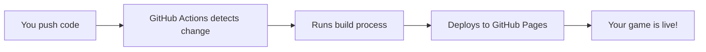
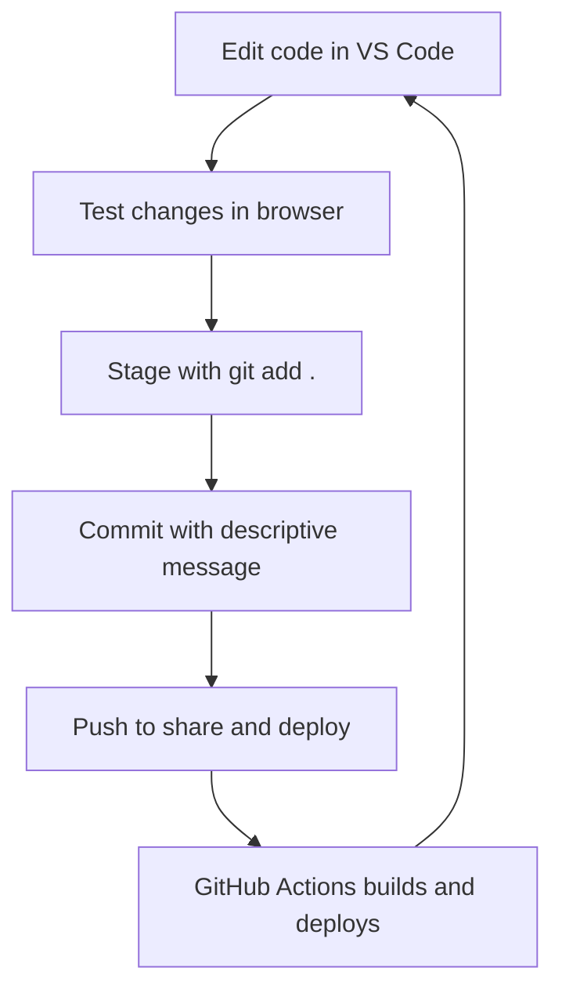

# Session 10 — Publishing Your Game

Version Control & Deployment 🚀

You're about to take your trivia game from local development to the live internet! This guide walks you through version control concepts, Git workflows, and automated deployment using GitHub Pages. Ready to share your creation with the world? Let's go!

## Table of Contents

- [Understanding Version Control](#understanding-version-control)
- [Understanding CI/CD](#understanding-cicd)
- [Make This Project Yours](#make-this-project-yours)
- [The Git Workflow](#the-git-workflow)
- [Watch Your Deployment](#watch-your-deployment)
- [Share Your Live Game](#share-your-live-game)
- [Essential Terms](#essential-terms)
- [Ask the AI](#ask-the-ai)

<a id="access-your-codespace"></a>

## ☁️ Access Your Codespace

Visit [github.com/codespaces](https://github.com/codespaces) to relaunch your Codespace from Session 9.

<a id="understanding-version-control"></a>

## 📚 Understanding Version Control

Before we publish your game, let's understand **version control** — the system that tracks every change to your code and lets you collaborate safely with other developers.

**Version control** is like having a detailed history book for your project. Every time you make changes, you can create a snapshot (called a **commit**) that you can return to later. Think of it as "save points" in a video game — you can always go back to a previous state if something goes wrong.

### Why Version Control Exists

| Problem | Solution |
|---------|----------|
| **"My code worked yesterday!"** | **Git history** shows exactly what changed |
| **"I broke everything!"** | **Rollback** to any previous working version |
| **"Who changed this file?"** | **Blame/history** shows author and reason |
| **"How do we work together?"** | **Branches** let multiple people code simultaneously |

### How Version Control Works

**Version control** systems like **Git** work by tracking changes to files in a special folder called a **repository**. When you're ready to save your progress, you create a **commit** — a permanent snapshot of your project at that moment.

Think of **Git** as your project's memory system. It remembers every change you've ever made, who made it, and when. If you need to work on a new feature without breaking your main code, you can create a **branch** — like a parallel universe where you can experiment safely.

When you're ready to share your work or back it up online, you **push** your commits to a remote repository on platforms like GitHub. This uploads your entire project history, not just the current files.

### 💡 Why This Matters

**Version control** is essential for any serious development work. It's like having a time machine for your code — you can experiment fearlessly knowing you can always return to a working state. This safety net transforms how you approach coding, making you more willing to try new ideas and refactor existing code.

<a id="understanding-cicd"></a>

## ⚙️ Understanding CI/CD

Now let's understand **CI/CD** — the automated processes that build and deploy your code whenever you push changes.

**CI/CD** stands for **Continuous Integration/Continuous Deployment**. It's like having a robot assistant that automatically builds and publishes your app every time you save changes to GitHub.

### CI/CD Components

| Component | Purpose | Your Setup |
|-----------|---------|------------|
| **Continuous Integration (CI)** | Automatically test and build code when changes are pushed | **GitHub Actions** runs your build process |
| **Continuous Deployment (CD)** | Automatically deploy successful builds to production | **GitHub Pages** hosts your built app |
| **Build Process** | Convert source code into deployable files | **Vite** bundles your React app |
| **Hosting Platform** | Serve your app to users on the internet | **GitHub Pages** provides free hosting |

### 📊 How It Works



### 💡 Why This Matters

**CI/CD** eliminates manual deployment work. Instead of building and uploading files yourself, the system automatically handles everything when you push code. This is how teams deploy apps multiple times per day.

<a id="make-this-project-yours"></a>

## 🏠 Make This Project Yours

All `git` commands should be run in your Codespace terminal

### 1. Disconnect from the Starter Repo

This disconnects your project from the original Wizcamp repo, making way for your own!

```bash
git remote remove origin
```

### 2. Create a New Repo on GitHub

- **Go to**: [github.com/new](https://github.com/new)
- **Name your repo**, e.g., `trivia-quest`
- **Do not initialize** with a README or .gitignore — your project already has those!
- **Click "Create repository"**

### 3. Connect Your Project to Your New Repo

Replace `your-username` and `your-repo-name`:

```bash
git remote add origin https://github.com/your-username/your-repo-name.git
```

**Example**: `git remote add origin https://github.com/babalugats76/trivia-quest.git`

You can always use `git remote -v` to verify this connection

### 4. Update the Vite Build Path

Open `package.json` and update the `build` script to match your repo name:

```javascript
"build": "vite build --base=/your-repo-name/" // e.g. --base=/trivia-quest/
```

This ensures your site works correctly when deployed to GitHub Pages.

### 5. Enable GitHub Pages

- **Go to your repo** → **Settings** → **Pages**
- **Under "Source"**, choose **GitHub Actions**
- **Save** the settings

### 6. Authenticate with GitHub (Recommended)

```bash
gh auth login
```

This uses the GitHub CLI (gh), pre-installed in Codespaces, to authenticate you.

- **Choose**: GitHub.com
- **Choose**: HTTPS
- **Choose**: Authenticate via browser
- **GitHub opens a browser tab** with a one-time code
- **Copy and paste the code** to confirm

### 7. Push Your Code to GitHub

```bash
git push -u origin main
```

### 8. Verify Your Code Is On GitHub

- **Go to your GitHub profile**: `https://github.com/your-username`
- **Click on your new repo** (e.g., trivia-quest)
- **If you see your files**, your push worked! You now officially own your project!

### 9. Find Your Live Site

Once deployed, your site will be live at `https://your-username.github.io/your-repo-name/`

### 💡 Why This Matters

These steps transform your project from a shared template into your personal creation. Now you can make updates, publish changes to the web, and share your unique version with the world. Your trivia game is officially yours to customize and deploy!

<a id="the-git-workflow"></a>

## 🔄 The Git Workflow

Let's learn the essential daily workflow by making a real change to your game. We'll customize your game's title and see how every change follows the same pattern.

### Make a Change: Customize Your Game Title

Let's personalize your game by changing the title that appears on the splash screen:

1. **Open** `src/components/GameLogo.jsx`
2. **Find** these two text elements:
   ```javascript
   <text id="title-first-line">
     Wizcamp
   </text>
   <text id="title-second-line">
     Realms
   </text>
   ```
3. **Change** them to something that matches your game:
   ```javascript
   <text id="title-first-line">
     Trivia
   </text>
   <text id="title-second-line">
     Quest
   </text>
   ```
4. **Check your browser** - you should see the new title!

### 📊 Your Daily Git Workflow



### The Essential Git Commands

Now let's commit and share this change:

```bash
# 1. Stage your changes (prepare them for committing)
git add .

# 2. Commit your changes (create a permanent snapshot)
git commit -m "feat(logo): customize game title to Trivia Quest"

# 3. Push your changes (share with the world and trigger deployment)
git push
```

### Understanding Commit Messages

Every commit requires a message that explains what changed. These messages create a readable history - like a diary of your project's evolution.

The message `feat(logo): customize game title to Trivia Quest` follows a helpful pattern:
- **feat**: Type of change (other types: `fix`, `style`, `docs`)
- **(logo)**: What part of the app changed
- **customize game title**: What you actually did

### Common Message Types

| Type | Example | What It Means |
|------|---------|---------------|
| **feat** | `feat(quiz): add timer` | New feature |
| **fix** | `fix(scoring): resolve bug` | Bug fix |
| **style** | `style(button): update colors` | Visual changes |

### 💡 Why This Matters

This workflow stays consistent across all development - games, websites, mobile apps. The predictable pattern helps you build good habits and work confidently with any codebase.ld good habits and work confidently with any codebase.
<a id="watch-your-deployment"></a>

## 👀 Watch Your Deployment

Now let's trace your GameLogo title change through the entire deployment pipeline!

### 1. Monitor GitHub Actions

- **Go to your repository** on GitHub
- **Click the "Actions" tab** to see the build process
- **Find your latest workflow run** (should show "feat(logo): customize game title to Trivia Quest")
- **Click on the workflow** to see the build process in real-time
- **Wait for the green checkmark** — this means deployment succeeded!

### 2. Verify Your Code Changes

- **Check your repository** — you should see your latest commit
- **Look at the commit history** — your GameLogo change is now part of the project's permanent record
- **Browse the code** — click on `src/components/GameLogo.jsx` to see your title changes in the repository

### 3. Test Your Live Game

- **Go to Settings** → **Pages** to find your live URL
- **Visit your live game** at `https://your-username.github.io/your-repo-name/`
- **Check the splash screen** — you should see "Trivia Quest" instead of "Wizcamp Realms"!
- **Test all features** — zones, questions, scoring, music

### 💡 Why This Matters

You just traced a complete change from your local development environment through version control, automated building, and live deployment. This end-to-end visibility is crucial for understanding how modern web applications are built and maintained.
<a id="share-your-live-game"></a>

## 🌍 Share Your Live Game

Congratulations! Your trivia game is now live on the internet. Here's how to share it with others.

### Your Game's Public URL

Your game is available at:
```
https://your-username.github.io/your-repo-name/
```

**Example**: `https://babalugats76.github.io/trivia-quest/`

### Sharing Your Achievement

- **Copy the URL** and share it with friends and family
- **Test on different devices** — phones, tablets, computers
- **Share on social media** with screenshots of your game
- **Add the URL to your GitHub profile** or portfolio

### 💡 Why This Matters

Having your game live on the internet transforms it from a learning exercise into something real that others can actually use. You've built something that exists on the web — that's a genuine accomplishment!

<a id="essential-terms"></a>

## 📚 Essential Terms

_Quick reference for all the version control and deployment concepts you just learned:_

| Term | Definition | Why it matters |
|------|------------|----------------|
| 📚 version control | A system that tracks changes to files over time, allowing you to see history, revert changes, and collaborate safely. | Essential for any serious development work — lets you experiment fearlessly and work with others. |
| 📁 repository | A folder containing your project files and their complete change history, managed by Git. | Your project's home base where all code and history live — can be local (on your computer) or remote (on GitHub). |
| 📝 commit | A snapshot of your project at a specific point in time, with a message describing what changed. | Creates permanent save points you can return to — like checkpoints in a video game. |
| 🌿 branch | A separate copy of your code where you can experiment with new features without breaking your main code. | Lets you try new ideas safely — if something goes wrong, your main code stays untouched. |
| ⬆️ push | Upload your local commits to a remote repository like GitHub, making them available to others. | How you share your work and trigger automated deployments — essential for collaboration and publishing. |
| ⚙️ CI/CD | Continuous Integration/Continuous Deployment — automated processes that build and deploy code when changes are made. | Eliminates manual deployment work — your code automatically becomes a live website when you push changes. |
| 🤖 GitHub Actions | GitHub's automation platform that runs workflows (like building and deploying) when you push code. | Powers your automated deployment — builds your React app and publishes it without manual work. |
| 🌐 GitHub Pages | Free web hosting service that automatically publishes websites from GitHub repositories. | Turns your repository into a live website — perfect for React apps and portfolio projects. |

<a id="ask-the-ai"></a>

## 🤖 Ask the AI — Version Control & Deployment

You just published your trivia game to the internet using development workflows — excellent work!

Now let's deepen your understanding of version control, Git workflows, and deployment automation. Here are the most impactful questions to ask your AI assistant about today's session:out today's session:

- **Why is version control essential for software development, and what problems does it solve?**
- **What makes a good commit message, and why do they matter?**
- **How does the Git workflow (add, commit, push) relate to saving files on my computer?**
- **What are the benefits of automated deployment over manual file uploads?**
- **How do GitHub Actions and GitHub Pages work together to deploy websites?**
- **What's the difference between local repositories and remote repositories?**
- **How can I use version control for future projects and collaboration?**